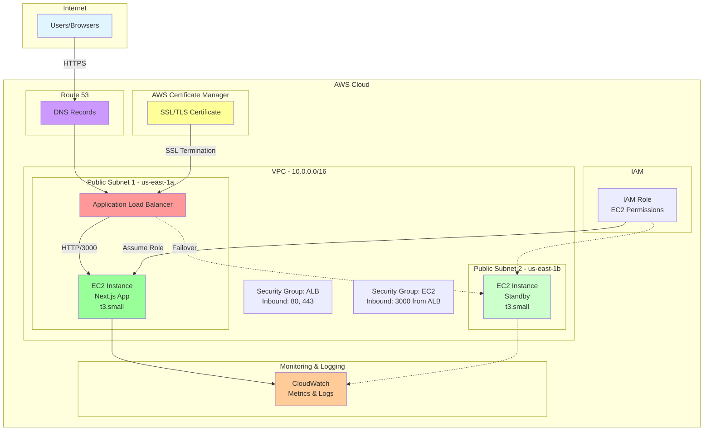

# Solution & Architecture Design Document
## Requirement & Effort Tracker MVP - Web Starter Kit

**Document Version:** 1.0
**Date:** 2025-12-19
**Author:** Solution Architect
**Status:** Proposed Architecture

---

## Table of Contents
1. [Overview](#1-overview)
2. [Architecture Diagram](#2-architecture-diagram)
3. [Infrastructure Components](#3-infrastructure-components)
4. [Deployment Architecture](#4-deployment-architecture)
5. [Network Architecture](#5-network-architecture)
6. [Scalability Considerations](#6-scalability-considerations)
7. [Security](#7-security)
8. [Monitoring & Logging](#8-monitoring--logging)
9. [Deployment Process](#9-deployment-process)
10. [Cost Estimation](#10-cost-estimation)
11. [Appendix](#11-appendix)

---

## 1. Overview

### 1.1 Application Description

The **Requirement & Effort Tracker MVP** is a Next.js 15.5+ web application built with React 19, TypeScript, and Tailwind CSS v4. The application provides users with a simple, unauthenticated interface for managing project requirements and tracking effort allocation.

**Key Characteristics:**
- **Framework:** Next.js 15.5+ with App Router
- **Frontend:** React 19, TypeScript, Tailwind CSS v4
- **Build System:** Turbopack for fast development and production builds
- **Data Persistence:** Client-side localStorage (browser-based)
- **Authentication:** None required (public access)
- **Backend:** No backend API (client-side only application)

### 1.2 Application Purpose

To provide users with a quick, accessible tool for:
- Creating and managing project requirements
- Assigning effort values to requirements
- Tracking total active effort dynamically
- Toggling requirement status (active/inactive)
- Managing requirement lifecycle (add, edit, delete)

### 1.3 Architecture Goals

1. **Simplicity:** Minimal AWS infrastructure with straightforward deployment
2. **Production-Ready:** Secure, reliable, and monitored infrastructure
3. **Cost-Effective:** Optimize for low operational costs while maintaining quality
4. **Scalability:** Design for easy horizontal scaling when needed
5. **Security:** Implement basic but robust security measures
6. **Maintainability:** Simple architecture that's easy to understand and manage

---

## 2. Architecture Diagram

### 2.1 High-Level Architecture



### 2.2 Network Flow

```
User Request Flow:
1. User → HTTPS (Port 443) → Route 53 DNS
2. Route 53 → ALB (with ACM SSL Certificate)
3. ALB → HTTP (Port 3000) → EC2 Instance (Target Group)
4. EC2 → Next.js Application (Node.js Server)
5. Next.js → Static Assets + Server-Rendered Pages
6. Response flows back through same path

Data Persistence:
- Client-side localStorage in user's browser
- No database or backend storage required
```

---

## 3. Infrastructure Components

### 3.1 Core AWS Services

#### 3.1.1 Amazon EC2 (Elastic Compute Cloud)

**Purpose:** Host and run the Next.js application

**Specifications:**
- **Instance Type:** t3.small (2 vCPU, 2 GB RAM)
- **Operating System:** Amazon Linux 2023 (AL2023)
- **Storage:** 20 GB GP3 EBS volume
- **Quantity:**
  - Production: 2 instances (primary + standby for HA)
  - Development: 1 instance (optional)

**Justification:**
- t3.small provides adequate resources for Next.js SSR workload
- Burstable performance suitable for variable traffic patterns
- Cost-effective for MVP deployment
- Amazon Linux 2023 for security updates and Node.js support

**Software Stack:**
- Node.js 20.x LTS
- npm/yarn for package management
- PM2 for process management and auto-restart
- Next.js application (production build)

#### 3.1.2 Elastic Load Balancing (Application Load Balancer)

**Purpose:** Distribute traffic, SSL termination, and health checks

**Configuration:**
- **Type:** Application Load Balancer (Layer 7)
- **Scheme:** Internet-facing
- **Availability Zones:** 2 (us-east-1a, us-east-1b)
- **Target Group:** EC2 instances on port 3000
- **Health Check:** HTTP GET / (every 30 seconds)
- **Listeners:**
  - Port 80 (HTTP) → Redirect to 443
  - Port 443 (HTTPS) → Forward to target group

**Justification:**
- Provides SSL/TLS termination (offload from EC2)
- Enables zero-downtime deployments
- Built-in health checks for high availability
- Simple to add more EC2 instances for scaling

#### 3.1.3 Amazon VPC (Virtual Private Cloud)

**Purpose:** Isolated network environment for resources

**Configuration:**
- **CIDR Block:** 10.0.0.0/16
- **Subnets:**
  - Public Subnet 1: 10.0.1.0/24 (us-east-1a)
  - Public Subnet 2: 10.0.2.0/24 (us-east-1b)
- **Internet Gateway:** Attached for public internet access
- **Route Tables:** Public route to Internet Gateway (0.0.0.0/0)

**Justification:**
- Simple public subnet architecture (no private subnets needed)
- Two availability zones for high availability
- No NAT Gateway required (cost savings)

#### 3.1.4 Security Groups

**Purpose:** Firewall rules for network access control

**ALB Security Group:**
- **Inbound:**
  - Port 80 (HTTP) from 0.0.0.0/0 (redirect to HTTPS)
  - Port 443 (HTTPS) from 0.0.0.0/0
- **Outbound:**
  - Port 3000 to EC2 Security Group
  - All traffic to 0.0.0.0/0 (for health checks)

**EC2 Security Group:**
- **Inbound:**
  - Port 3000 (HTTP) from ALB Security Group only
  - Port 22 (SSH) from specific IP ranges (admin access)
- **Outbound:**
  - All traffic to 0.0.0.0/0 (for package updates, npm install)

#### 3.1.5 AWS Certificate Manager (ACM)

**Purpose:** Manage SSL/TLS certificates for HTTPS

**Configuration:**
- Free SSL/TLS certificate for custom domain
- Auto-renewal enabled (no manual intervention)
- Attached to ALB listener (port 443)

**Justification:**
- Free SSL certificates (no cost)
- Automatic renewal (operational simplicity)
- Integrated with ALB

#### 3.1.6 Amazon Route 53 (Optional)

**Purpose:** DNS management for custom domain

**Configuration:**
- Hosted zone for custom domain (e.g., app.example.com)
- A record pointing to ALB DNS name (Alias record)

**Justification:**
- Managed DNS service (high availability)
- Easy to update DNS records
- Optional: Can use external DNS provider if preferred

#### 3.1.7 Amazon CloudWatch

**Purpose:** Monitoring, logging, and alerting

**Configuration:**
- **Metrics:**
  - EC2: CPU, Memory, Disk, Network
  - ALB: Request count, latency, target health
- **Logs:**
  - EC2: Application logs (Next.js)
  - EC2: System logs
  - ALB: Access logs (optional)
- **Alarms:**
  - High CPU utilization (>80%)
  - Unhealthy target count (>0)
  - ALB 5xx errors (threshold-based)

#### 3.1.8 IAM (Identity and Access Management)

**Purpose:** Secure access control and permissions

**Components:**
- **IAM Role for EC2:**
  - CloudWatch Logs write permissions
  - CloudWatch Metrics put permissions
  - S3 read-only (for deployment artifacts, if needed)
- **IAM Policies:** Least privilege principle
- **IAM Users:** For deployment automation (CI/CD)

---

## 4. Deployment Architecture

### 4.1 Application Deployment Model

**Deployment Type:** Node.js Server (Next.js Production Mode)

**Why Node.js Server (Not Static Export):**
- Enables Server-Side Rendering (SSR) capabilities for future enhancements
- Supports dynamic routes and API routes (if needed later)
- Better SEO capabilities (though not critical for this MVP)
- Allows for easy addition of backend features without architecture changes

**Alternative:** Static Export
- Could export Next.js as static HTML/CSS/JS
- Deploy to S3 + CloudFront (simpler, cheaper)
- Loses SSR capabilities
- Recommended if SSR is definitively not needed

### 4.2 EC2 Instance Setup

**Application Structure on EC2:**
```
/home/ec2-user/
  └── app/
      ├── .next/                 # Production build output
      ├── public/                # Static assets
      ├── node_modules/          # Dependencies
      ├── package.json           # Project dependencies
      ├── next.config.ts         # Next.js configuration
      └── ecosystem.config.js    # PM2 configuration
```

**Process Management:**
- **PM2** for running Next.js in production
- Auto-restart on crashes
- Log management (rotation, retention)
- Cluster mode (utilize all CPU cores)

**PM2 Configuration Example:**
```javascript
// ecosystem.config.js
module.exports = {
  apps: [{
    name: 'requirement-tracker',
    script: 'node_modules/.bin/next',
    args: 'start',
    instances: 'max',
    exec_mode: 'cluster',
    env: {
      NODE_ENV: 'production',
      PORT: 3000
    },
    error_file: '/var/log/pm2/app-error.log',
    out_file: '/var/log/pm2/app-out.log',
    log_date_format: 'YYYY-MM-DD HH:mm:ss Z'
  }]
}
```

### 4.3 Build Process

**Local Build (Option 1):**
```bash
# Build on local machine or CI/CD
npm run build  # Creates optimized production build
# Upload build artifacts to EC2
```

**Remote Build (Option 2):**
```bash
# Build directly on EC2
git pull origin main
npm install --production
npm run build
pm2 restart all
```

**Recommended:** Option 1 (local/CI build) for consistency and faster deployments

### 4.4 Application Configuration

**Environment Variables:**
```bash
NODE_ENV=production
PORT=3000
HOSTNAME=0.0.0.0  # Listen on all interfaces
```

**Next.js Configuration:**
```typescript
// next.config.ts
const nextConfig = {
  output: 'standalone',  // Optimized production output
  reactStrictMode: true,
  poweredByHeader: false, // Remove X-Powered-By header for security
}
```

---

## 5. Network Architecture

### 5.1 VPC Design

**CIDR Block:** 10.0.0.0/16 (65,536 IP addresses)

**Subnet Strategy:**
- **Public Subnets Only:** Simplifies architecture (no NAT Gateway needed)
- **Multi-AZ:** Two subnets in different availability zones for HA

**Subnet Breakdown:**
```
VPC: 10.0.0.0/16
├── Public Subnet 1: 10.0.1.0/24 (us-east-1a) - 256 IPs
│   ├── ALB (primary AZ)
│   └── EC2 Instance 1
└── Public Subnet 2: 10.0.2.0/24 (us-east-1b) - 256 IPs
    ├── ALB (secondary AZ)
    └── EC2 Instance 2 (standby)
```

### 5.2 Routing

**Route Table (Public Subnets):**
| Destination | Target | Purpose |
|-------------|--------|---------|
| 10.0.0.0/16 | local | VPC internal traffic |
| 0.0.0.0/0 | igw-xxx | Internet access |

### 5.3 Security Groups Configuration

**ALB Security Group (sg-alb-xxx):**
```
Inbound Rules:
- Port 80 (HTTP) from 0.0.0.0/0 → Redirect to HTTPS
- Port 443 (HTTPS) from 0.0.0.0/0 → Application traffic

Outbound Rules:
- Port 3000 to sg-ec2-xxx → Forward to EC2 instances
- All traffic to 0.0.0.0/0 → Health checks and external calls
```

**EC2 Security Group (sg-ec2-xxx):**
```
Inbound Rules:
- Port 3000 from sg-alb-xxx → Application traffic from ALB only
- Port 22 (SSH) from [Admin IPs] → SSH access for deployment/maintenance

Outbound Rules:
- All traffic to 0.0.0.0/0 → Internet access (npm, updates, external APIs)
```

### 5.4 Network Flow Diagram

```
Internet (Users)
      ↓ HTTPS (443)
[Route 53 DNS]
      ↓
[ALB - Public IP]
      ↓ HTTP (3000)
[EC2 Instances - Private IPs]
      ↓
[Next.js Application]
      ↓
[Response back to user]

Note: All components in public subnets with Internet Gateway access
```

### 5.5 Network Security Layers

1. **Layer 1 - Network ACLs:** Default (allow all) - sufficient for simple architecture
2. **Layer 2 - Security Groups:** Restrictive rules (defined above)
3. **Layer 3 - Application:** Next.js security headers, CORS policies
4. **Layer 4 - TLS/SSL:** Encrypted communication (ALB to user)

---

## 6. Scalability Considerations

### 6.1 Current Architecture (MVP)

**Capacity:**
- **Traffic:** ~1,000 concurrent users
- **Requests:** ~10,000 requests/day
- **Storage:** Client-side only (no database)

**Bottlenecks:**
- Single EC2 instance (mitigated by standby instance)
- CPU/Memory limits of t3.small

### 6.2 Horizontal Scaling (Adding More EC2 Instances)

**Steps to Scale Out:**
1. Launch additional EC2 instances (same AMI)
2. Register new instances with ALB target group
3. ALB automatically distributes traffic across all healthy instances
4. No application code changes required

**Scaling Trigger:**
- CPU utilization > 70% sustained for 5 minutes
- Request latency > 500ms at 95th percentile

**Auto Scaling Group (Future Enhancement):**
- Min: 2 instances
- Desired: 2 instances
- Max: 6 instances
- Scale up: +1 instance when CPU > 70%
- Scale down: -1 instance when CPU < 30%

### 6.3 Vertical Scaling (Larger Instance Type)

**Upgrade Path:**
```
t3.small (2 vCPU, 2 GB) → Current
t3.medium (2 vCPU, 4 GB) → 2x memory
t3.large (2 vCPU, 8 GB) → 4x memory
t3.xlarge (4 vCPU, 16 GB) → Better for CPU-intensive workloads
```

**When to Vertical Scale:**
- Memory pressure (high swap usage)
- CPU-intensive operations (rendering, builds)
- Fewer, larger instances often simpler to manage

### 6.4 Scalability Best Practices

1. **Stateless Application:**
   - No session data on EC2 instances
   - All state in client browser (localStorage)
   - Easy to add/remove instances

2. **Immutable Infrastructure:**
   - Deploy new instances with updated code
   - No in-place updates
   - Blue-green deployments possible

3. **Health Checks:**
   - ALB health checks ensure only healthy instances receive traffic
   - Automatic failover to healthy instances

4. **Load Balancer:**
   - Already in place (ALB)
   - Distributes traffic evenly
   - Supports sticky sessions (if needed in future)

### 6.5 Scaling Limitations (Current Architecture)

**Not Addressed in MVP:**
- Database scaling (no database in MVP)
- Static asset caching (can add CloudFront later)
- API rate limiting (no backend API)
- Geographic distribution (single region)

**Simple Solutions for Future:**
- **CloudFront:** Add CDN for global edge caching
- **ElastiCache:** Add Redis for session/cache (if needed)
- **RDS/Aurora:** Add database (if moving from localStorage)

---

## 7. Security

### 7.1 Network Security

**Encryption in Transit:**
- **HTTPS Only:** ALB enforces TLS 1.2+ for all user traffic
- **HTTP to HTTPS Redirect:** Port 80 redirects to 443 automatically
- **SSL Certificate:** ACM-managed certificate (free, auto-renewed)
- **ALB to EC2:** HTTP (unencrypted) - acceptable within VPC, can use HTTPS if needed

**Security Groups:**
- **Principle of Least Privilege:** Only required ports open
- **Source Restriction:** EC2 only accepts traffic from ALB, not public internet
- **SSH Access:** Restricted to admin IP addresses (not 0.0.0.0/0)

**Network Isolation:**
- VPC provides network isolation from other AWS customers
- Security groups act as instance-level firewalls

### 7.2 Compute Security

**EC2 Instance Hardening:**
- **OS Updates:** Regular patching via `yum update` (Amazon Linux)
- **Minimal Software:** Only install required packages
- **No Root Login:** SSH as ec2-user, use sudo for admin tasks
- **SSH Key Pairs:** Key-based authentication (no passwords)
- **Disable Unused Services:** Stop unnecessary daemons

**Application Security:**
- **Next.js Security Headers:**
  ```javascript
  // next.config.ts
  headers: async () => [
    {
      source: '/:path*',
      headers: [
        { key: 'X-Frame-Options', value: 'DENY' },
        { key: 'X-Content-Type-Options', value: 'nosniff' },
        { key: 'X-XSS-Protection', value: '1; mode=block' },
        { key: 'Referrer-Policy', value: 'strict-origin-when-cross-origin' }
      ]
    }
  ]
  ```
- **Content Security Policy (CSP):** Restrict script sources
- **CORS:** Configure allowed origins if adding API later
- **Input Validation:** Client-side validation (already implemented)

**Process Isolation:**
- Run Next.js as non-root user (ec2-user)
- PM2 manages process lifecycle
- No privileged ports (using 3000, not 80/443)

### 7.3 IAM Security

**EC2 IAM Role:**
- **Assume Role Policy:** Trust policy for EC2 service
- **Attached Policies:**
  - `CloudWatchAgentServerPolicy` (managed policy)
  - Custom policy for S3 read (if needed for deployments)
- **No Access Keys:** Instance profile for authentication

**Deployment User (CI/CD):**
- IAM user with programmatic access
- Limited permissions:
  - EC2: Describe instances, create/manage instances (via CloudFormation/Terraform)
  - ALB: Register/deregister targets
  - S3: Upload deployment artifacts
  - CloudFormation: Deploy stacks
- **MFA Required:** For sensitive operations (production)

**AWS Account Security:**
- **Root Account:** MFA enabled, not used for daily operations
- **IAM Users:** Individual accounts for team members
- **Password Policy:** Strong passwords, rotation every 90 days
- **Access Keys Rotation:** Rotate every 90 days

### 7.4 Data Security

**Client-Side Data:**
- **localStorage:** Data stored in user's browser (under user's control)
- **No Sensitive Data:** Application doesn't handle PII, passwords, or sensitive info
- **Client-Side Only:** No server-side data storage (nothing to breach)

**Logs:**
- **No Sensitive Data in Logs:** Don't log user data, tokens, or credentials
- **Log Retention:** 7-30 days in CloudWatch (configurable)
- **Access Control:** IAM policies restrict log access to authorized users

### 7.5 Compliance & Best Practices

**AWS Well-Architected Framework:**
- Security Pillar best practices applied
- Regular security reviews recommended

**Recommendations:**
- **AWS GuardDuty:** Enable for threat detection (optional, adds cost)
- **AWS Config:** Track configuration changes (optional)
- **VPC Flow Logs:** Network traffic logging (optional, adds cost)
- **AWS Systems Manager:** Patch management automation (recommended)

### 7.6 Security Checklist

- [x] HTTPS enforced for all user traffic
- [x] Security groups restrict access to required ports only
- [x] SSH access restricted to admin IPs
- [x] IAM roles used (no hardcoded credentials)
- [x] OS and packages kept up to date
- [x] Application security headers configured
- [x] SSL certificate managed by ACM (auto-renewal)
- [x] Regular backups not required (stateless, no database)
- [ ] WAF (optional for advanced protection)
- [ ] GuardDuty (optional threat detection)

---

## 8. Monitoring & Logging

### 8.1 CloudWatch Metrics

**EC2 Metrics (Automatic):**
- **CPU Utilization:** Percentage of CPU used
- **Network In/Out:** Bytes sent/received
- **Disk Read/Write Ops:** IOPS metrics
- **Status Checks:** Instance and system health

**Custom Metrics (via CloudWatch Agent):**
- **Memory Utilization:** Percentage of RAM used
- **Disk Space Used:** Free space monitoring
- **Process Count:** Number of running processes
- **Application Metrics:** Custom Next.js metrics (optional)

**ALB Metrics (Automatic):**
- **Request Count:** Total requests per minute
- **Target Response Time:** Latency (p50, p95, p99)
- **Healthy Host Count:** Number of healthy targets
- **HTTP 2xx/4xx/5xx Count:** Response code distribution
- **Active Connection Count:** Current connections

**Metric Retention:**
- High-resolution (1 minute): 15 days
- Standard (5 minutes): 63 days
- Aggregated (1 hour): 455 days

### 8.2 CloudWatch Logs

**Log Groups:**
```
/aws/ec2/requirement-tracker/application    # Next.js application logs
/aws/ec2/requirement-tracker/system         # System logs (syslog, auth)
/aws/ec2/requirement-tracker/pm2            # PM2 process logs
/aws/elasticloadbalancing/alb               # ALB access logs (optional)
```

**Application Logging:**
- **stdout/stderr:** Captured by PM2, forwarded to CloudWatch
- **Log Format:** JSON structured logs (recommended)
- **Log Levels:** ERROR, WARN, INFO, DEBUG
- **Retention:** 7 days (configurable, balance cost vs. needs)

**Example Log Format:**
```json
{
  "timestamp": "2025-12-19T10:30:45.123Z",
  "level": "INFO",
  "message": "User added requirement",
  "requestId": "abc123",
  "userId": "anonymous",
  "action": "add_requirement"
}
```

**CloudWatch Logs Insights:**
- Query logs using CloudWatch Logs Insights
- Example queries:
  - Error rate: `fields @timestamp, message | filter level = "ERROR" | stats count() by bin(5m)`
  - Slowest requests: `fields @timestamp, duration | sort duration desc | limit 20`

### 8.3 CloudWatch Alarms

**Critical Alarms (PagerDuty/SMS):**
1. **Unhealthy Target Count:**
   - Metric: HealthyHostCount < 1
   - Duration: 2 consecutive periods (2 minutes)
   - Action: Alert on-call engineer

2. **High CPU (Sustained):**
   - Metric: CPUUtilization > 90%
   - Duration: 3 consecutive periods (15 minutes)
   - Action: Alert team, consider scaling

3. **ALB 5xx Errors:**
   - Metric: HTTPCode_Target_5XX_Count > 10
   - Duration: 1 period (5 minutes)
   - Action: Alert team, investigate immediately

**Warning Alarms (Email/Slack):**
1. **Elevated CPU:**
   - Metric: CPUUtilization > 70%
   - Duration: 5 minutes
   - Action: Email notification, investigate trends

2. **High Memory Usage:**
   - Metric: MemoryUtilization > 80%
   - Duration: 10 minutes
   - Action: Email notification, consider instance type

3. **Disk Space Low:**
   - Metric: DiskSpaceUtilization > 80%
   - Duration: 5 minutes
   - Action: Email notification, clean up or expand volume

**Informational Alarms (Email):**
1. **High Request Rate:**
   - Metric: RequestCount > 1000/minute
   - Duration: 5 minutes
   - Action: Log for capacity planning

### 8.4 Application Performance Monitoring (Optional)

**Recommended Tools:**
- **New Relic:** Full-stack APM (free tier available)
- **Datadog:** Infrastructure + application monitoring
- **AWS X-Ray:** Distributed tracing (AWS native)
- **Sentry:** Error tracking and monitoring

**Benefits:**
- Real user monitoring (RUM)
- Transaction tracing
- Error tracking with stack traces
- Performance bottleneck identification

**MVP Approach:** Start with CloudWatch, add APM tool if needed

### 8.5 Dashboard & Visualization

**CloudWatch Dashboard:**
Create a single dashboard with key metrics:
- EC2 CPU/Memory/Disk
- ALB request count and latency
- Target health status
- Alarm status summary

**Dashboard JSON Export:**
- Save dashboard as code (infrastructure as code)
- Version control in Git
- Easy to recreate in new environments

### 8.6 Log Aggregation & Analysis

**Current Approach:**
- CloudWatch Logs (native, simple)
- CloudWatch Logs Insights for queries

**Advanced Options (Future):**
- **ELK Stack:** Elasticsearch, Logstash, Kibana (self-hosted or AWS OpenSearch)
- **Splunk:** Enterprise log management
- **Sumo Logic:** Cloud-based log analytics

**MVP Recommendation:** CloudWatch Logs is sufficient for MVP

---

## 9. Deployment Process

### 9.1 Initial Setup (One-Time)

**Step 1: Infrastructure Provisioning**
```bash
# Option A: Manual (AWS Console)
# - Create VPC, subnets, IGW
# - Create security groups
# - Launch EC2 instances
# - Create ALB and target group
# - Request ACM certificate
# - Configure Route 53

# Option B: Infrastructure as Code (Terraform/CloudFormation)
terraform init
terraform plan
terraform apply
```

**Step 2: EC2 Instance Configuration**
```bash
# SSH to EC2 instance
ssh -i key.pem ec2-user@<instance-ip>

# Update system
sudo yum update -y

# Install Node.js 20.x
curl -fsSL https://rpm.nodesource.com/setup_20.x | sudo bash -
sudo yum install -y nodejs

# Install PM2 globally
sudo npm install -g pm2

# Install CloudWatch agent
wget https://s3.amazonaws.com/amazoncloudwatch-agent/amazon_linux/amd64/latest/amazon-cloudwatch-agent.rpm
sudo rpm -U ./amazon-cloudwatch-agent.rpm

# Configure PM2 to start on boot
pm2 startup systemd -u ec2-user --hp /home/ec2-user
sudo env PATH=$PATH:/usr/bin pm2 startup systemd -u ec2-user --hp /home/ec2-user
```

**Step 3: Application Deployment**
```bash
# Create application directory
mkdir -p /home/ec2-user/app
cd /home/ec2-user/app

# Clone repository (or upload build artifacts)
git clone <repository-url> .

# Install dependencies
npm install --production

# Build application
npm run build

# Start with PM2
pm2 start ecosystem.config.js
pm2 save
```

**Step 4: Verification**
```bash
# Check PM2 status
pm2 status

# Check application logs
pm2 logs

# Test local endpoint
curl http://localhost:3000

# Check from ALB (from outside)
curl https://your-domain.com
```

### 9.2 Regular Deployment Workflow

**Manual Deployment:**
```bash
# 1. Build locally
npm run build

# 2. Upload to EC2
scp -i key.pem -r .next package.json ec2-user@<instance-ip>:/home/ec2-user/app/

# 3. SSH to EC2 and restart
ssh -i key.pem ec2-user@<instance-ip>
cd /home/ec2-user/app
npm install --production
pm2 restart all
```

**Zero-Downtime Deployment (Blue-Green):**
```bash
# 1. Deploy to standby instance (Instance 2)
# - Upload new build
# - Test on Instance 2 directly
# - Verify health check passes

# 2. Shift traffic
# - ALB starts sending traffic to Instance 2
# - Monitor for errors

# 3. Update primary instance (Instance 1)
# - Deploy to Instance 1
# - Restart application
# - Verify health check

# 4. Both instances now running new version
```

### 9.3 CI/CD Pipeline (Recommended)

**GitHub Actions Workflow Example:**
```yaml
name: Deploy to Production

on:
  push:
    branches: [main]

jobs:
  deploy:
    runs-on: ubuntu-latest
    steps:
      - uses: actions/checkout@v3

      - name: Setup Node.js
        uses: actions/setup-node@v3
        with:
          node-version: '20'

      - name: Install dependencies
        run: npm ci

      - name: Build application
        run: npm run build

      - name: Deploy to EC2
        env:
          SSH_PRIVATE_KEY: ${{ secrets.SSH_PRIVATE_KEY }}
          HOST: ${{ secrets.EC2_HOST }}
        run: |
          # Copy build artifacts to EC2
          scp -r .next package.json ec2-user@$HOST:/home/ec2-user/app/

          # Restart application
          ssh ec2-user@$HOST 'cd /home/ec2-user/app && npm install --production && pm2 restart all'
```

**Pipeline Stages:**
1. **Code Checkout:** Pull latest code from Git
2. **Build:** Run `npm run build` (with tests)
3. **Test:** Run unit/integration tests (if applicable)
4. **Deploy to Staging:** Deploy to staging EC2 (if exists)
5. **Smoke Tests:** Verify staging works
6. **Deploy to Production:** Deploy to production EC2
7. **Verification:** Run health checks, monitor logs

### 9.4 Rollback Procedure

**Quick Rollback:**
```bash
# Option 1: Rollback to previous PM2 version
pm2 start /home/ec2-user/app-previous/ecosystem.config.js

# Option 2: Keep multiple builds
/home/ec2-user/app-v1/
/home/ec2-user/app-v2/
/home/ec2-user/app-current -> symlink to active version

# Switch symlink
ln -sf /home/ec2-user/app-v1 /home/ec2-user/app-current
pm2 restart all

# Option 3: Git-based rollback
git checkout <previous-commit>
npm run build
pm2 restart all
```

**ALB-Based Rollback:**
- Deregister updated instance from target group
- Traffic automatically shifts to old version instance
- Fix issue, redeploy

### 9.5 Deployment Checklist

**Pre-Deployment:**
- [ ] Code reviewed and approved
- [ ] Tests passing locally
- [ ] Build successful
- [ ] Staging tested (if applicable)
- [ ] Backup plan ready (rollback steps)

**During Deployment:**
- [ ] Monitor CloudWatch metrics
- [ ] Watch application logs (`pm2 logs`)
- [ ] Check ALB target health
- [ ] Verify health check endpoint responding

**Post-Deployment:**
- [ ] Smoke test critical user flows
- [ ] Monitor for errors (5 minutes)
- [ ] Check performance metrics
- [ ] Verify no alarms triggered
- [ ] Document deployment in changelog

### 9.6 Deployment Best Practices

1. **Deploy during low-traffic periods:** Minimize user impact
2. **Deploy to one instance first:** Test before full rollout
3. **Keep previous version:** For quick rollback
4. **Monitor closely:** First 15 minutes post-deployment
5. **Communicate:** Notify team of deployment status
6. **Document:** Keep deployment log (who, when, what)

---

## 10. Cost Estimation

### 10.1 Monthly Cost Breakdown (Production - 2 EC2 Instances)

**Core Infrastructure:**

| Service | Configuration | Quantity | Unit Cost | Monthly Cost | Notes |
|---------|--------------|----------|-----------|--------------|-------|
| **EC2 Instances** | t3.small (2 vCPU, 2GB) | 2 | $0.0208/hr | $30.00 | 730 hrs/month, reserved pricing available |
| **EBS Volumes** | 20 GB GP3 | 2 | $0.08/GB | $3.20 | Root volume storage |
| **Application Load Balancer** | Internet-facing ALB | 1 | $16.20/month + $0.008/LCU-hr | $22.00 | Base + ~730 LCU-hrs/month |
| **Data Transfer Out** | Internet transfer | 100 GB | $0.09/GB | $9.00 | First 100 GB/month |
| **CloudWatch Logs** | Log ingestion/storage | 5 GB | $0.50/GB | $2.50 | 5 GB ingestion, 7 days retention |
| **CloudWatch Metrics** | Custom metrics | 10 metrics | $0.30/metric | $3.00 | Beyond free tier |
| **Route 53** | Hosted zone + queries | 1 zone | $0.50/zone + $0.40/million queries | $1.00 | ~1M queries/month |
| **ACM Certificate** | SSL/TLS certificate | 1 | Free | $0.00 | Free with ALB |
| **VPC** | Standard VPC | 1 | Free | $0.00 | No NAT Gateway |

**Subtotal (Production):** ~$70.70/month

**Optional/Variable Costs:**

| Service | Configuration | Monthly Cost | Notes |
|---------|--------------|--------------|-------|
| **Elastic IP** | 1 static IP (if needed) | $3.60 | Only if not using ALB DNS |
| **CloudWatch Alarms** | Beyond 10 free alarms | $0.10/alarm | First 10 alarms free |
| **S3** | Deployment artifacts | $0.50 | Small bucket for builds |
| **Backup Snapshots** | EBS snapshots (optional) | $1.00 | Weekly snapshots |
| **Enhanced Monitoring** | EC2 detailed monitoring | $2.10 | 1-minute metrics (optional) |

**Total Estimated Cost (Production):** **$71-80/month**

### 10.2 Cost Optimization Opportunities

**Savings Opportunities:**

1. **EC2 Reserved Instances:**
   - 1-year commitment: Save ~40% ($18/month instead of $30)
   - 3-year commitment: Save ~60% ($12/month instead of $30)
   - **Savings:** $12-18/month (2 instances)

2. **EC2 Savings Plans:**
   - Flexible compute savings (EC2, Fargate, Lambda)
   - Similar savings to Reserved Instances
   - More flexible (can change instance types)

3. **Right-Sizing:**
   - Monitor actual CPU/memory usage
   - Downsize to t3.micro (1 vCPU, 1GB) if sufficient: $7/month (save $23/month per instance)
   - Or t3.nano (2 vCPU, 0.5GB): $3.5/month (save $26.50/month per instance)

4. **ALB Optimization:**
   - Use ALB only if needed (for SSL, HA)
   - Alternative: Use Elastic IP + single EC2 (save $22/month, lose HA)
   - Alternative: CloudFront + S3 (static site, save EC2+ALB costs)

5. **CloudWatch Logs:**
   - Reduce retention to 3 days (save ~50% log costs)
   - Log only errors, not info/debug (reduce ingestion)

6. **Data Transfer:**
   - Enable compression (gzip) to reduce transfer
   - Use CloudFront for static assets (free first 1TB/month outbound)

**Optimized Production Cost:** ~$40-50/month (with reservations + optimizations)

### 10.3 Development/Staging Environment Cost

**Minimal Staging Setup:**
- 1x t3.micro EC2: $7/month
- No ALB (direct EC2 access): $0
- Same VPC (shared): $0
- Minimal CloudWatch: $1/month
- **Total:** ~$8/month

**Staging Recommendations:**
- Use on-demand (no commitment)
- Stop when not in use (save ~70% by running 8hrs/day weekdays only)
- Share VPC/security groups with production

### 10.4 Scaling Cost Impact

**Scenario: 2x Traffic (Add 2 More EC2 Instances)**
- 2 additional t3.small: +$30/month
- Increased data transfer: +$5/month
- Increased CloudWatch logs: +$2/month
- **Total:** +$37/month → $108/month (4 instances)

**Scenario: 10x Traffic (6 EC2 Instances + Larger ALB)**
- 6x t3.small: $90/month
- ALB with higher throughput: $40/month
- Increased data transfer: $30/month
- CloudWatch: $10/month
- **Total:** ~$170/month

### 10.5 Cost Comparison with Alternatives

**Alternative 1: Static Hosting (S3 + CloudFront)**
- S3 storage: $1/month
- CloudFront: $1/month (free tier covers most MVP traffic)
- Route 53: $1/month
- **Total:** ~$3/month
- **Tradeoff:** No SSR, no dynamic backend possible

**Alternative 2: Serverless (AWS Lambda + API Gateway)**
- Lambda: $1-5/month (depends on traffic)
- API Gateway: $3-10/month
- CloudFront: $1/month
- **Total:** ~$5-15/month
- **Tradeoff:** Cold starts, complex for SSR

**Alternative 3: Managed Platform (AWS Amplify Hosting)**
- Amplify Hosting: $15/month (build + hosting)
- **Total:** ~$15/month
- **Tradeoff:** Less control, more abstraction

**Alternative 4: Container-Based (AWS Fargate)**
- Fargate task (0.25 vCPU, 0.5GB): $10-15/month per task
- ALB: $22/month
- **Total:** ~$45-60/month (2 tasks)
- **Tradeoff:** More complexity, better for microservices

**Recommendation for MVP:** Current EC2 + ALB architecture provides best balance of cost, simplicity, and flexibility

### 10.6 Cost Monitoring & Budgets

**AWS Cost Explorer:**
- Track daily/monthly spending
- Forecast future costs
- Identify cost trends

**AWS Budgets:**
- Set budget alert: $100/month
- Alert at 80% threshold ($80)
- Alert at 100% threshold (overrun)
- Email/SNS notifications

**Cost Allocation Tags:**
- Tag all resources with:
  - `Environment: production`
  - `Project: requirement-tracker`
  - `Owner: team-name`
- Track costs per tag in Cost Explorer

### 10.7 Annual Cost Projection

**Year 1 (On-Demand):**
- Monthly: $75/month
- Annual: $900/year

**Year 1 (Reserved Instances - 1 Year):**
- Monthly: $55/month
- Annual: $660/year (+ $250 upfront for reservations)
- **Total:** $910 first year, $660 subsequent months

**Year 1-3 (Reserved Instances - 3 Year):**
- Monthly: $40/month
- Annual: $480/year (+ $500 upfront for reservations)
- **Total:** $980 first year, $480 subsequent years
- **3-Year Total:** $1,940 (vs. $2,700 on-demand) → **Save $760**

**Recommendation:** Start with on-demand, commit to reservations after 3-6 months of stable usage

---

## 11. Appendix

### 11.1 Architecture Alternatives Considered

**Alternative 1: Static Site (S3 + CloudFront)**
- **Pros:** Lowest cost ($3/month), highest scalability, simplest
- **Cons:** No SSR, no backend API capability
- **Decision:** Not chosen - want flexibility for future SSR features

**Alternative 2: Serverless (Lambda + API Gateway)**
- **Pros:** Pay-per-use, auto-scaling, no server management
- **Cons:** Cold starts, complex Next.js integration, higher latency
- **Decision:** Not chosen - complexity outweighs benefits for MVP

**Alternative 3: Container-Based (ECS Fargate)**
- **Pros:** Container-based, easier multi-service architectures
- **Cons:** More complex than EC2, higher cost, steeper learning curve
- **Decision:** Not chosen - over-engineering for simple application

**Alternative 4: Managed Next.js (Vercel)**
- **Pros:** Optimized for Next.js, zero DevOps, auto-scaling
- **Cons:** Vendor lock-in, higher cost at scale, less control
- **Decision:** Not chosen - want to own infrastructure and control costs

**Chosen Architecture: EC2 + ALB**
- **Rationale:**
  - Simple to understand and maintain
  - Full control over infrastructure
  - Cost-effective for MVP
  - Easy to scale vertically and horizontally
  - Supports SSR and future backend needs
  - Proven, battle-tested approach

### 11.2 Infrastructure as Code

**Terraform Example Structure:**
```
terraform/
├── main.tf              # Main configuration
├── variables.tf         # Input variables
├── outputs.tf           # Output values
├── vpc.tf               # VPC, subnets, IGW
├── security-groups.tf   # Security group rules
├── alb.tf               # Application Load Balancer
├── ec2.tf               # EC2 instances
├── iam.tf               # IAM roles and policies
├── cloudwatch.tf        # CloudWatch alarms and dashboards
└── route53.tf           # DNS records
```

**Benefits:**
- Version controlled infrastructure
- Reproducible environments (dev, staging, prod)
- Easy to review changes (Terraform plan)
- Automated provisioning
- Documentation as code

### 11.3 Disaster Recovery

**Backup Strategy:**
- **Application Code:** Git repository (already backed up)
- **Infrastructure:** Terraform/CloudFormation (infrastructure as code)
- **EC2 AMI:** Create AMI snapshot monthly (optional, $1-2/month)
- **User Data:** Client-side localStorage (no backup needed from infrastructure)

**Recovery Time Objective (RTO):** 30 minutes
- Launch new EC2 instance from AMI
- Or rebuild from scratch (10 minutes)
- Deploy application (5 minutes)
- Update ALB target group (2 minutes)
- DNS propagation (5-30 minutes, can be reduced with lower TTL)

**Recovery Point Objective (RPO):** 0 minutes (stateless application)
- No data loss possible (no server-side data)
- Latest code deployed from Git

**High Availability:**
- Current: 2 AZs, 2 EC2 instances
- Expected uptime: 99.5% (ALB) × 99.5% (EC2) = 99%+ combined
- Acceptable for MVP

### 11.4 Performance Benchmarks

**Expected Performance (Single t3.small Instance):**
- **Concurrent Users:** 500-1,000
- **Requests/Second:** 50-100 RPS
- **Response Time (p95):** < 200ms
- **Response Time (p99):** < 500ms
- **Throughput:** 5-10 MB/s

**Load Testing Recommendations:**
- Use Apache Bench, Artillery, or k6
- Test before production launch
- Test scenarios:
  - Normal load: 50 RPS for 5 minutes
  - Peak load: 100 RPS for 1 minute
  - Spike: 500 RPS for 10 seconds
- Monitor CPU, memory, response times

### 11.5 Next Steps & Roadmap

**Phase 1: MVP Launch (Current)**
- Deploy 2 EC2 instances + ALB
- Basic monitoring with CloudWatch
- Manual deployment process
- **Timeline:** Week 1-2

**Phase 2: Automation (Month 2)**
- Implement CI/CD with GitHub Actions
- Infrastructure as Code (Terraform)
- Automated testing pipeline
- **Timeline:** Month 2

**Phase 3: Optimization (Month 3-6)**
- Analyze costs, consider reserved instances
- Implement auto-scaling (if traffic warrants)
- Add CloudFront for static assets
- Optimize CloudWatch costs
- **Timeline:** Month 3-6

**Phase 4: Advanced Features (Month 6+)**
- Consider backend API (if needed)
- Database for multi-user support
- User authentication
- CloudFront global distribution
- **Timeline:** As needed

### 11.6 Decision Log

| Date | Decision | Rationale |
|------|----------|-----------|
| 2025-12-19 | Use EC2 instead of Lambda | Simpler for SSR, avoid cold starts |
| 2025-12-19 | Use ALB instead of NLB | Layer 7 routing, SSL termination |
| 2025-12-19 | Public subnets only | No private resources, avoid NAT costs |
| 2025-12-19 | t3.small instance type | Balance of cost and performance |
| 2025-12-19 | 2 instances minimum | High availability, redundancy |
| 2025-12-19 | No database initially | Client-side localStorage sufficient |
| 2025-12-19 | CloudWatch for monitoring | Native AWS, simple, sufficient for MVP |
| 2025-12-19 | Manual deployment initially | Quick to implement, automate later |

### 11.7 Glossary

- **ALB:** Application Load Balancer (AWS Layer 7 load balancer)
- **AMI:** Amazon Machine Image (EC2 template)
- **AZ:** Availability Zone (isolated data center)
- **CIDR:** Classless Inter-Domain Routing (IP address notation)
- **EC2:** Elastic Compute Cloud (virtual servers)
- **EBS:** Elastic Block Store (persistent storage volumes)
- **IGW:** Internet Gateway (VPC internet access)
- **IAM:** Identity and Access Management (AWS permissions)
- **RTO:** Recovery Time Objective (time to recover)
- **RPO:** Recovery Point Objective (acceptable data loss)
- **SSR:** Server-Side Rendering (Next.js feature)
- **TLS:** Transport Layer Security (encryption protocol)
- **VPC:** Virtual Private Cloud (isolated network)

### 11.8 References

- **AWS Well-Architected Framework:** https://aws.amazon.com/architecture/well-architected/
- **Next.js Deployment Docs:** https://nextjs.org/docs/deployment
- **AWS EC2 Pricing:** https://aws.amazon.com/ec2/pricing/
- **AWS ALB Pricing:** https://aws.amazon.com/elasticloadbalancing/pricing/
- **PM2 Documentation:** https://pm2.keymetrics.io/docs/usage/quick-start/
- **CloudWatch Best Practices:** https://docs.aws.amazon.com/AmazonCloudWatch/latest/monitoring/Best_Practice_Recommended_Alarms_AWS_Services.html

### 11.9 Contact & Support

**Architecture Questions:**
- Solution Architect: [Your Name]
- Email: [your-email@example.com]

**AWS Support:**
- AWS Console: https://console.aws.amazon.com/support/
- Support Plan: Basic (free) or Developer ($29/month)

**Escalation:**
- Critical issues: [On-call rotation]
- Infrastructure changes: [Change approval process]

---

## Revision History

| Version | Date | Author | Changes |
|---------|------|--------|---------|
| 1.0 | 2025-12-19 | Solution Architect | Initial architecture document for MVP |

---

**End of Document**

**Status:** Ready for Review & Implementation
**Next Steps:** Review with team, provision infrastructure, deploy application
