# Technical Specification Document
## Requirement & Effort Tracker MVP

**Document Version:** 1.0
**Date:** 2025-12-19
**Status:** Active
**Project:** Requirement & Effort Tracker MVP

---

## Table of Contents

1. [Project Overview](#1-project-overview)
2. [Project Structure](#2-project-structure)
3. [API Specifications](#3-api-specifications)
4. [Business Logic & Sequence Diagrams](#4-business-logic--sequence-diagrams)
5. [Data Schema](#5-data-schema)
6. [Architecture Diagrams](#6-architecture-diagrams)
7. [Integration Contracts](#7-integration-contracts)
8. [Development Guidelines](#8-development-guidelines)
9. [Appendix](#9-appendix)

---

## 1. Project Overview

### 1.1 Purpose

The **Requirement & Effort Tracker MVP** is a client-side web application that enables users to quickly capture project requirements, assign effort values, and dynamically track the total effort of active requirements. The application is designed for simplicity, requiring no authentication and storing all data locally in the browser.

### 1.2 Technology Stack

| Layer | Technology | Version | Purpose |
|-------|-----------|---------|---------|
| **Framework** | Next.js | 15.5+ | React framework with App Router |
| **Runtime** | React | 19 | UI library |
| **Language** | TypeScript | 5+ | Type-safe JavaScript |
| **Styling** | Tailwind CSS | v4 | Utility-first CSS framework |
| **Build Tool** | Turbopack | Latest | Fast build system |
| **Data Storage** | localStorage | Browser API | Client-side persistence |
| **Package Manager** | npm | Latest | Dependency management |

### 1.3 Key Features

- ✅ Unauthenticated access (no login required)
- ✅ Project name management
- ✅ CRUD operations for requirements
- ✅ Effort value tracking (decimal support)
- ✅ Active/Inactive status toggle
- ✅ Real-time total effort calculation
- ✅ Effort column visibility toggle
- ✅ Local browser persistence
- ✅ Responsive design (mobile and desktop)
- ✅ Form validation with inline error messages

### 1.4 Development Environment Setup

**Prerequisites:**
```bash
# Required software
Node.js 20.x LTS or higher
npm 10.x or higher
Git 2.x or higher

# Verify installations
node --version
npm --version
git --version
```

**Installation:**
```bash
# Clone repository
git clone <repository-url>
cd web-starter-kit

# Install dependencies
npm install

# Start development server
npm run dev

# Access application
# Open http://localhost:3000 in browser
```

**Build Commands:**
```bash
# Development server (with Turbopack)
npm run dev

# Production build (with Turbopack)
npm run build

# Start production server
npm start

# Run linter
npm run lint
```

---

## 2. Project Structure

### 2.1 Directory Structure

```
web-starter-kit/
├── src/                          # Source code directory
│   ├── app/                      # Next.js App Router directory
│   │   ├── layout.tsx            # Root layout component
│   │   ├── page.tsx              # Homepage/main application
│   │   └── globals.css           # Global styles
│   ├── components/               # React components (to be created)
│   │   ├── ProjectHeader/
│   │   │   ├── ProjectHeader.tsx
│   │   │   └── ProjectNameEdit.tsx
│   │   ├── RequirementForm/
│   │   │   ├── RequirementForm.tsx
│   │   │   └── FormValidation.ts
│   │   ├── RequirementsList/
│   │   │   ├── RequirementsList.tsx
│   │   │   ├── RequirementRow.tsx
│   │   │   ├── RequirementEditRow.tsx
│   │   │   └── EmptyState.tsx
│   │   ├── TotalEffort/
│   │   │   └── TotalEffortCard.tsx
│   │   ├── Modals/
│   │   │   ├── DeleteConfirmationModal.tsx
│   │   │   └── ClearAllConfirmationModal.tsx
│   │   └── UI/
│   │       ├── Button.tsx
│   │       ├── Input.tsx
│   │       ├── Toggle.tsx
│   │       └── Modal.tsx
│   ├── lib/                      # Utility functions and services
│   │   ├── storage/
│   │   │   ├── localStorage.ts   # localStorage wrapper
│   │   │   ├── project.ts        # Project data operations
│   │   │   ├── requirements.ts   # Requirements data operations
│   │   │   └── preferences.ts    # User preferences operations
│   │   ├── validation/
│   │   │   ├── projectValidation.ts
│   │   │   └── requirementValidation.ts
│   │   └── utils/
│   │       ├── calculations.ts   # Effort calculation utilities
│   │       └── formatters.ts     # Date/number formatting
│   ├── types/                    # TypeScript type definitions
│   │   ├── project.ts
│   │   ├── requirement.ts
│   │   └── preferences.ts
│   └── hooks/                    # Custom React hooks
│       ├── useLocalStorage.ts
│       ├── useProject.ts
│       ├── useRequirements.ts
│       └── usePreferences.ts
├── public/                       # Static assets
│   └── (static files)
├── docs/                         # Documentation
│   ├── requirement.md
│   ├── data-schema.md
│   ├── architecture.md
│   └── technical-spec.md
├── ui-prototypes/                # HTML mockups
│   └── (prototype files)
├── next.config.ts                # Next.js configuration
├── tsconfig.json                 # TypeScript configuration
├── postcss.config.mjs            # PostCSS configuration
├── tailwind.config.ts            # Tailwind CSS configuration
├── package.json                  # Project dependencies
└── README.md                     # Project README
```

### 2.2 Module Responsibilities

#### 2.2.1 App Directory (`src/app/`)

**Purpose:** Next.js App Router pages and layouts

- `layout.tsx`: Root layout with font configuration and global styles
- `page.tsx`: Main application page component
- `globals.css`: Global CSS with Tailwind imports and theme configuration

#### 2.2.2 Components Directory (`src/components/`)

**Purpose:** Reusable React components organized by feature

| Component Group | Responsibility | Components |
|----------------|----------------|------------|
| **ProjectHeader/** | Project name display and editing | ProjectHeader, ProjectNameEdit |
| **RequirementForm/** | Adding new requirements | RequirementForm, FormValidation |
| **RequirementsList/** | Displaying and managing requirements | RequirementsList, RequirementRow, RequirementEditRow, EmptyState |
| **TotalEffort/** | Displaying total active effort | TotalEffortCard |
| **Modals/** | Confirmation dialogs | DeleteConfirmationModal, ClearAllConfirmationModal |
| **UI/** | Reusable UI primitives | Button, Input, Toggle, Modal |

#### 2.2.3 Library Directory (`src/lib/`)

**Purpose:** Business logic, data operations, and utilities

| Subdirectory | Responsibility | Files |
|-------------|----------------|-------|
| **storage/** | localStorage operations | localStorage.ts, project.ts, requirements.ts, preferences.ts |
| **validation/** | Input validation logic | projectValidation.ts, requirementValidation.ts |
| **utils/** | Helper functions | calculations.ts, formatters.ts |

#### 2.2.4 Types Directory (`src/types/`)

**Purpose:** TypeScript type definitions and interfaces

- `project.ts`: Project-related types
- `requirement.ts`: Requirement-related types
- `preferences.ts`: User preferences types

#### 2.2.5 Hooks Directory (`src/hooks/`)

**Purpose:** Custom React hooks for state management

- `useLocalStorage.ts`: Generic localStorage hook
- `useProject.ts`: Project data management
- `useRequirements.ts`: Requirements CRUD operations
- `usePreferences.ts`: User preferences management

---

## 3. API Specifications

Since this is a **client-side only application**, there are no backend API endpoints. Instead, all data operations use the browser's **localStorage API**. The following sections define the data operations as if they were API endpoints.

### 3.1 localStorage Storage Keys

**Namespace:** `req-tracker`

| Storage Key | Data Type | Description |
|------------|-----------|-------------|
| `req-tracker:schema-version` | string | Schema version for migrations |
| `req-tracker:project` | JSON (Project) | Project metadata |
| `req-tracker:requirements` | JSON (Requirement[]) | Array of requirements |
| `req-tracker:preferences` | JSON (UserPreferences) | User display preferences |

### 3.2 Data Operations

#### 3.2.1 Project Operations

##### Get Project

**Function Signature:**
```typescript
function getProject(): Project | null
```

**Description:** Retrieves the current project from localStorage

**Request Parameters:** None

**Response:**
```typescript
// Success
{
  name: string;
  createdAt: string; // ISO 8601
  lastModifiedAt: string; // ISO 8601
}

// Empty state
null
```

**Error Handling:**
- Returns `null` if no project exists
- Returns `null` if JSON parsing fails
- Logs error to console on failure

**Example:**
```typescript
const project = getProject();
if (project) {
  console.log(`Project: ${project.name}`);
}
```

---

##### Create Project

**Function Signature:**
```typescript
function createProject(name: string): Project
```

**Description:** Creates a new project and saves to localStorage

**Request Parameters:**
| Parameter | Type | Required | Validation |
|-----------|------|----------|------------|
| `name` | string | Yes | 1-100 chars, trimmed |

**Response:**
```typescript
{
  name: string;
  createdAt: string;
  lastModifiedAt: string;
}
```

**Validation Rules:**
- If `name` is empty after trimming, defaults to "Untitled Project"
- Maximum length: 100 characters
- Whitespace-only strings treated as empty

**Side Effects:**
- Writes to localStorage key: `req-tracker:project`
- Updates `createdAt` and `lastModifiedAt` timestamps

**Example:**
```typescript
const project = createProject("E-commerce Platform");
// Result: { name: "E-commerce Platform", createdAt: "2025-12-19T...", ... }
```

---

##### Update Project Name

**Function Signature:**
```typescript
function updateProjectName(newName: string): void
```

**Description:** Updates the project name

**Request Parameters:**
| Parameter | Type | Required | Validation |
|-----------|------|----------|------------|
| `newName` | string | Yes | 1-100 chars, trimmed |

**Response:** void (no return value)

**Validation Rules:**
- Same as createProject
- If validation fails, no changes are saved

**Side Effects:**
- Updates `req-tracker:project` in localStorage
- Updates `lastModifiedAt` timestamp
- Preserves `createdAt` timestamp

**Error Handling:**
- Silent failure if project doesn't exist
- No error thrown, operation is skipped

**Example:**
```typescript
updateProjectName("Mobile App Development");
```

---

#### 3.2.2 Requirement Operations

##### Get All Requirements

**Function Signature:**
```typescript
function getRequirements(): Requirement[]
```

**Description:** Retrieves all requirements from localStorage

**Request Parameters:** None

**Response:**
```typescript
[
  {
    id: string;
    description: string;
    effort: number;
    isActive: boolean;
    createdAt: string;
    lastModifiedAt: string;
  },
  // ... more requirements
]

// Empty state
[]
```

**Error Handling:**
- Returns `[]` if no requirements exist
- Returns `[]` if JSON parsing fails
- Logs error to console on failure

**Example:**
```typescript
const requirements = getRequirements();
console.log(`Total requirements: ${requirements.length}`);
```

---

##### Get Requirement By ID

**Function Signature:**
```typescript
function getRequirementById(id: string): Requirement | null
```

**Description:** Retrieves a single requirement by ID

**Request Parameters:**
| Parameter | Type | Required |
|-----------|------|----------|
| `id` | string | Yes |

**Response:**
```typescript
// Found
{
  id: string;
  description: string;
  effort: number;
  isActive: boolean;
  createdAt: string;
  lastModifiedAt: string;
}

// Not found
null
```

**Example:**
```typescript
const requirement = getRequirementById("a1b2c3d4-e5f6-7890-abcd-ef1234567890");
```

---

##### Create Requirement

**Function Signature:**
```typescript
function createRequirement(description: string, effort: number): Requirement
```

**Description:** Creates a new requirement and saves to localStorage

**Request Parameters:**
| Parameter | Type | Required | Validation |
|-----------|------|----------|------------|
| `description` | string | Yes | 1-500 chars, trimmed, no whitespace-only |
| `effort` | number | Yes | 0.1-1000, positive, decimal allowed |

**Response:**
```typescript
{
  id: string; // Generated UUID
  description: string;
  effort: number;
  isActive: true; // Always true for new requirements
  createdAt: string;
  lastModifiedAt: string;
}
```

**Validation Rules:**

**Description:**
- Must not be empty or whitespace-only
- Maximum length: 500 characters
- Special characters allowed
- Trimmed before storage

**Effort:**
- Must be a positive number > 0
- Minimum: 0.1
- Maximum: 1000
- Decimal values allowed (e.g., 0.5, 2.5, 13.75)
- Must be valid JavaScript number (not NaN or Infinity)

**Error Messages:**
```typescript
// Description errors
"Requirement description is required"
"Description must not exceed 500 characters"

// Effort errors
"Effort value is required"
"Effort must be a number"
"Effort must be greater than 0"
"Effort must not exceed 1000"
```

**Side Effects:**
- Generates unique ID using `crypto.randomUUID()`
- Appends to requirements array in localStorage
- Sets `isActive` to `true` by default
- Sets timestamps

**Example:**
```typescript
const requirement = createRequirement(
  "User authentication system",
  8
);
```

---

##### Update Requirement

**Function Signature:**
```typescript
function updateRequirement(id: string, updates: Partial<Requirement>): void
```

**Description:** Updates an existing requirement

**Request Parameters:**
| Parameter | Type | Required | Description |
|-----------|------|----------|-------------|
| `id` | string | Yes | Requirement ID |
| `updates` | Partial<Requirement> | Yes | Fields to update |

**Allowed Update Fields:**
- `description`: string (validated)
- `effort`: number (validated)
- `isActive`: boolean (no validation)

**Protected Fields (Cannot be updated):**
- `id`: Immutable
- `createdAt`: Immutable
- `lastModifiedAt`: Auto-updated

**Response:** void

**Validation Rules:**
- Same validation as createRequirement
- Only provided fields are validated
- Partial updates allowed

**Side Effects:**
- Updates `req-tracker:requirements` in localStorage
- Updates `lastModifiedAt` timestamp
- Preserves all other fields

**Error Handling:**
- Silent failure if requirement ID not found
- No error thrown, operation is skipped

**Example:**
```typescript
updateRequirement("a1b2c3d4...", {
  description: "Enhanced user authentication",
  effort: 10
});
```

---

##### Toggle Requirement Status

**Function Signature:**
```typescript
function toggleRequirementStatus(id: string): void
```

**Description:** Toggles the isActive status of a requirement

**Request Parameters:**
| Parameter | Type | Required |
|-----------|------|----------|
| `id` | string | Yes |

**Response:** void

**Behavior:**
- `isActive: true` → `isActive: false`
- `isActive: false` → `isActive: true`

**Side Effects:**
- Updates `req-tracker:requirements` in localStorage
- Updates `lastModifiedAt` timestamp
- Affects total effort calculation

**Example:**
```typescript
toggleRequirementStatus("a1b2c3d4...");
```

---

##### Delete Requirement

**Function Signature:**
```typescript
function deleteRequirement(id: string): void
```

**Description:** Permanently deletes a requirement

**Request Parameters:**
| Parameter | Type | Required |
|-----------|------|----------|
| `id` | string | Yes |

**Response:** void

**Behavior:**
- Removes requirement from array
- Permanent deletion (no undo)

**Side Effects:**
- Updates `req-tracker:requirements` in localStorage
- Requirement cannot be recovered

**Error Handling:**
- Silent failure if requirement ID not found
- No error thrown if ID doesn't exist

**Example:**
```typescript
deleteRequirement("a1b2c3d4...");
```

---

##### Calculate Total Active Effort

**Function Signature:**
```typescript
function calculateTotalActiveEffort(): number
```

**Description:** Calculates the sum of effort for all active requirements

**Request Parameters:** None

**Response:**
```typescript
number // Rounded to 2 decimal places
```

**Calculation Logic:**
```typescript
const total = requirements
  .filter(req => req.isActive === true)
  .reduce((sum, req) => sum + req.effort, 0);

return Math.round(total * 100) / 100; // Round to 2 decimals
```

**Example:**
```typescript
// Requirements:
// [{ effort: 5, isActive: true }, { effort: 10.5, isActive: false }, { effort: 15, isActive: true }]

const total = calculateTotalActiveEffort();
// Result: 20.00 (5 + 15)
```

---

#### 3.2.3 User Preferences Operations

##### Get Preferences

**Function Signature:**
```typescript
function getPreferences(): UserPreferences
```

**Description:** Retrieves user display preferences

**Request Parameters:** None

**Response:**
```typescript
{
  effortColumnVisible: boolean;
  showTotalWhenEffortHidden: boolean;
}
```

**Default Values:**
```typescript
{
  effortColumnVisible: true,
  showTotalWhenEffortHidden: true
}
```

**Example:**
```typescript
const preferences = getPreferences();
if (!preferences.effortColumnVisible) {
  // Hide effort column
}
```

---

##### Update Preferences

**Function Signature:**
```typescript
function updatePreferences(updates: Partial<UserPreferences>): void
```

**Description:** Updates user display preferences

**Request Parameters:**
| Parameter | Type | Required |
|-----------|------|----------|
| `updates` | Partial<UserPreferences> | Yes |

**Allowed Fields:**
- `effortColumnVisible`: boolean
- `showTotalWhenEffortHidden`: boolean

**Response:** void

**Side Effects:**
- Updates `req-tracker:preferences` in localStorage
- Merges with existing preferences

**Example:**
```typescript
updatePreferences({ effortColumnVisible: false });
```

---

#### 3.2.4 Clear All Data

**Function Signature:**
```typescript
function clearAllData(): void
```

**Description:** Deletes all application data from localStorage

**Request Parameters:** None

**Response:** void

**Behavior:**
- Removes all `req-tracker:*` keys from localStorage
- Keeps `req-tracker:schema-version` for migration purposes (optional)

**Side Effects:**
- Permanent data deletion
- Application returns to initial state
- No undo available

**Example:**
```typescript
if (confirm("Are you sure?")) {
  clearAllData();
  window.location.reload(); // Reload to initial state
}
```

---

## 4. Business Logic & Sequence Diagrams

### 4.1 Application Initialization Flow

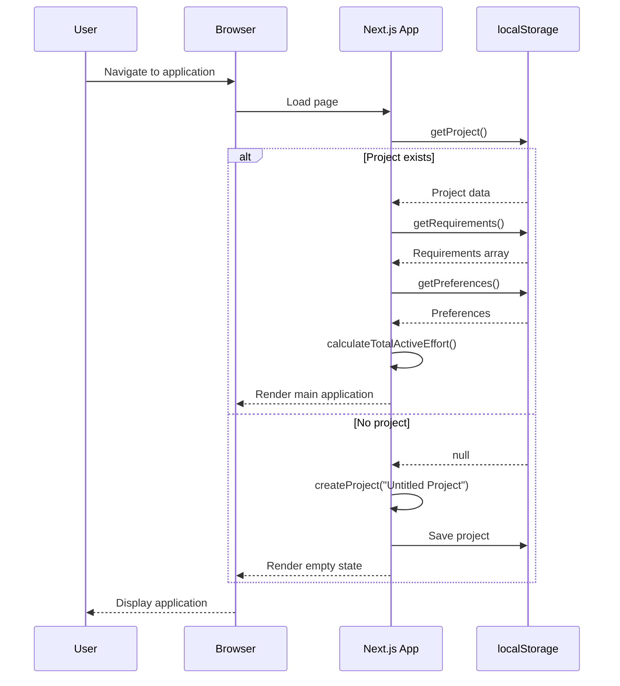

**Steps:**
1. User navigates to application URL
2. Next.js loads the page component
3. App attempts to load project from localStorage
4. If project exists:
   - Load requirements array
   - Load user preferences
   - Calculate total active effort
   - Render application with data
5. If no project exists:
   - Create default project ("Untitled Project")
   - Save to localStorage
   - Render empty state
6. Display application to user

---

### 4.2 Add Requirement Flow

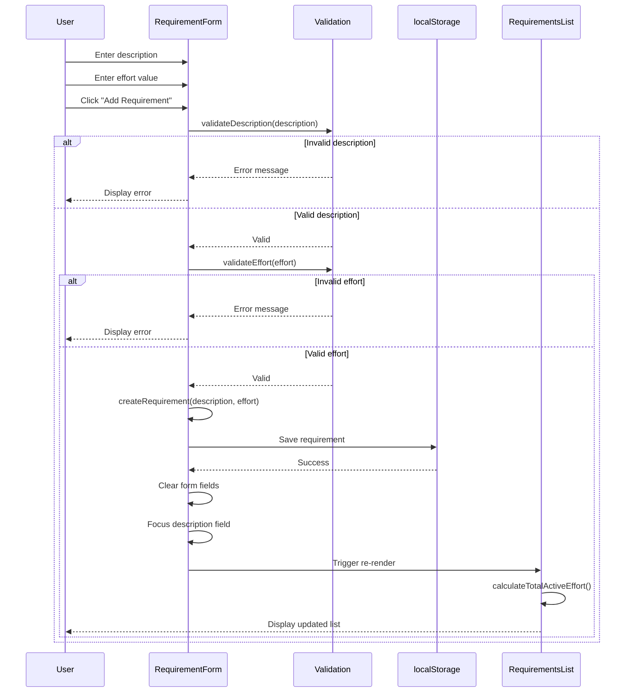

**Validation Logic:**

**Description Validation:**
```typescript
function validateDescription(description: string): ValidationResult {
  const trimmed = description.trim();

  if (trimmed.length === 0) {
    return { valid: false, error: "Requirement description is required" };
  }

  if (trimmed.length > 500) {
    return { valid: false, error: "Description must not exceed 500 characters" };
  }

  return { valid: true };
}
```

**Effort Validation:**
```typescript
function validateEffort(effort: any): ValidationResult {
  if (effort === null || effort === undefined || effort === '') {
    return { valid: false, error: "Effort value is required" };
  }

  const numericEffort = Number(effort);

  if (isNaN(numericEffort)) {
    return { valid: false, error: "Effort must be a number" };
  }

  if (numericEffort <= 0) {
    return { valid: false, error: "Effort must be greater than 0" };
  }

  if (numericEffort > 1000) {
    return { valid: false, error: "Effort must not exceed 1000" };
  }

  if (!isFinite(numericEffort)) {
    return { valid: false, error: "Effort must be a valid number" };
  }

  return { valid: true, value: numericEffort };
}
```

---

### 4.3 Edit Requirement Flow

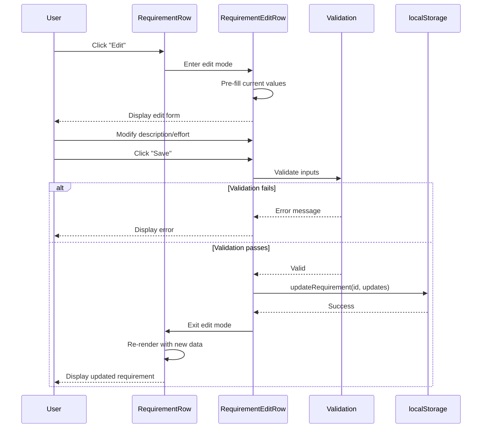

**Business Rules:**
1. Only one requirement can be in edit mode at a time
2. Editing a requirement automatically cancels any other in-progress edit
3. Cancel button discards all changes and restores original values
4. Status (active/inactive) is preserved during edit
5. `lastModifiedAt` timestamp is updated on save

---

### 4.4 Delete Requirement Flow

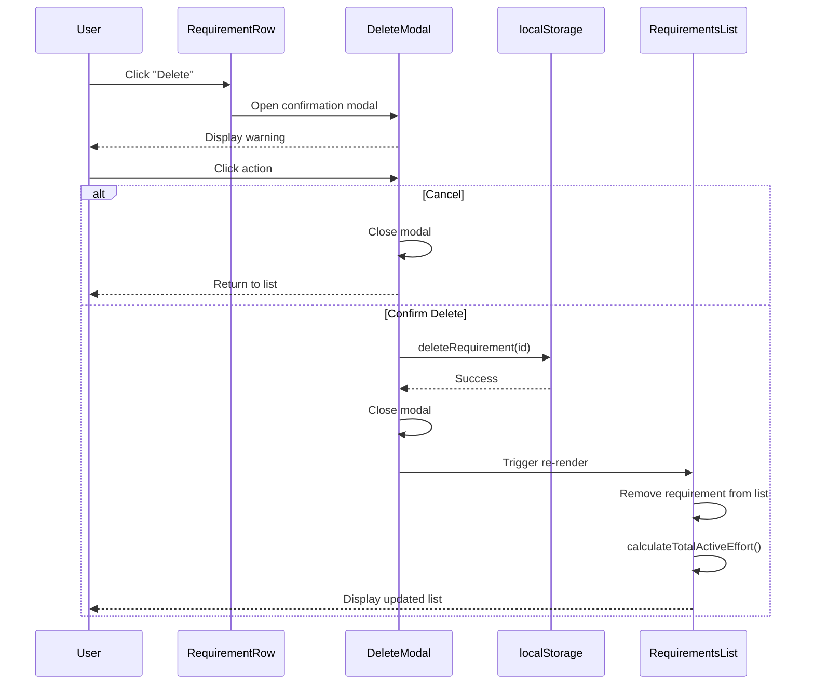

**Business Rules:**
1. Confirmation modal required before deletion
2. Deletion is permanent (no undo)
3. Deleting an active requirement updates total effort
4. Deleting an inactive requirement doesn't affect total effort

---

### 4.5 Toggle Status Flow

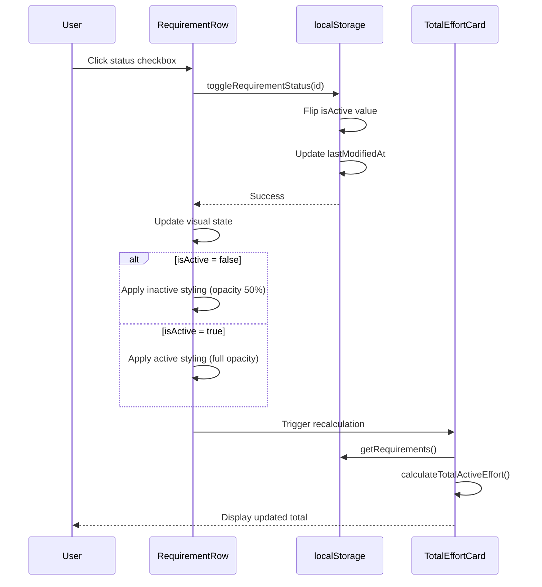

**Visual State Changes:**
- **Active (isActive = true):** Full opacity, normal appearance
- **Inactive (isActive = false):** 50% opacity or grayed-out background

---

### 4.6 Clear All Data Flow

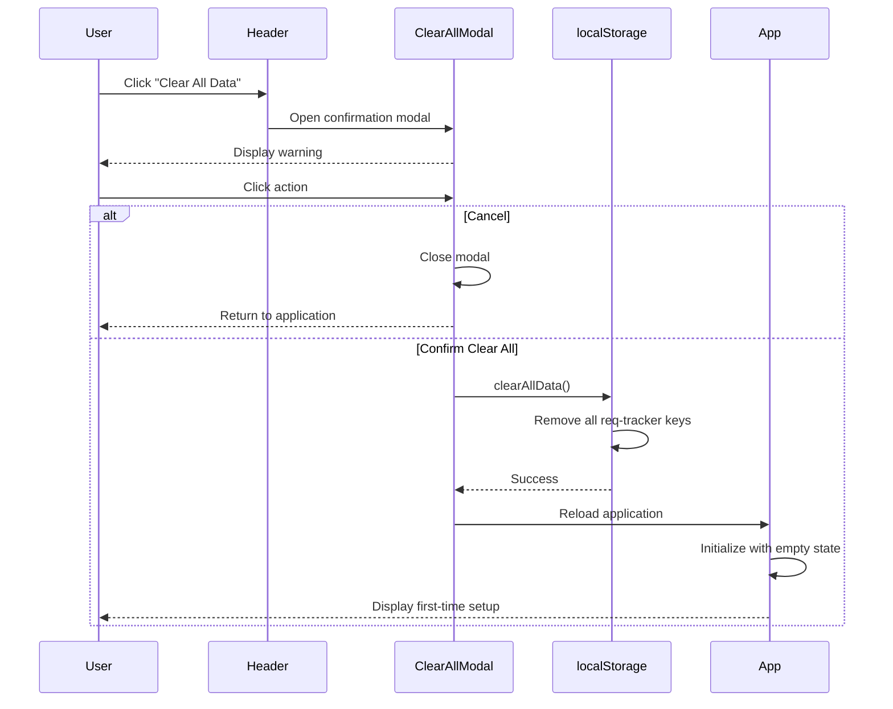

**Business Rules:**
1. Strong warning message in confirmation modal
2. Permanent deletion (no undo)
3. Application reloads to initial state after clearing
4. Schema version may be preserved for migrations

---

### 4.7 Toggle Effort Column Visibility Flow

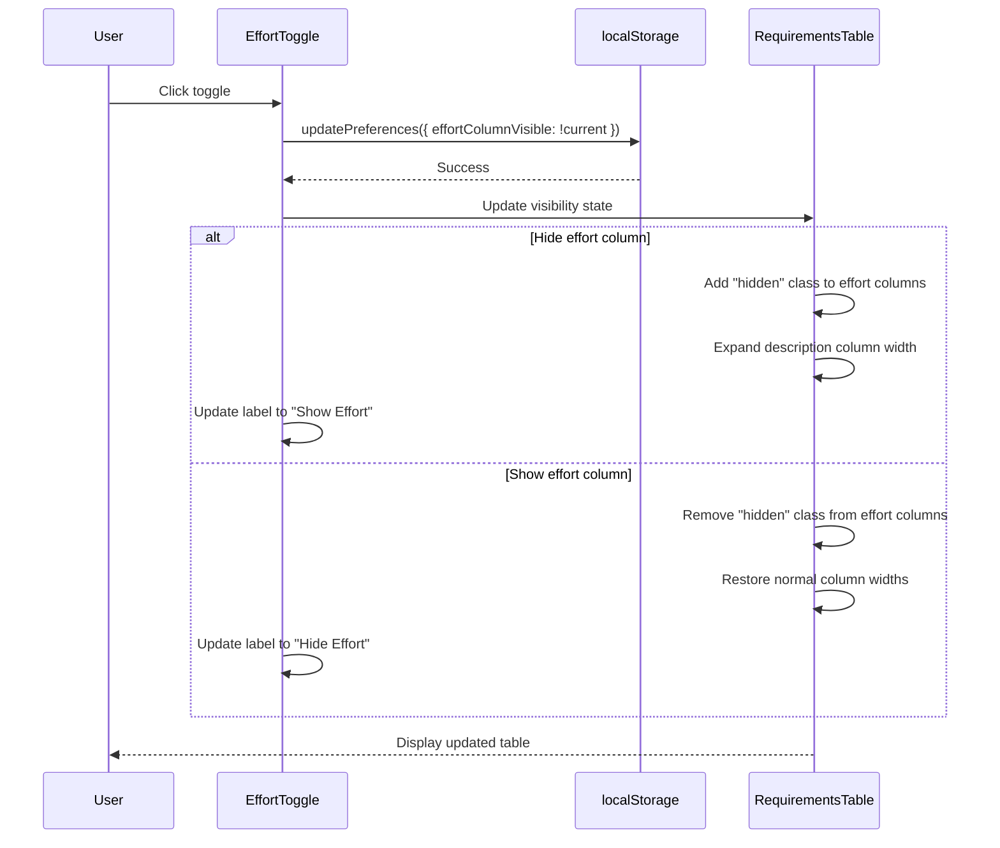

**Business Rules:**
1. Preference is saved immediately to localStorage
2. Preference persists across browser sessions
3. Total effort card visibility can be controlled separately (optional)

---

## 5. Data Schema

### 5.1 TypeScript Type Definitions

#### 5.1.1 Project Type

```typescript
/**
 * Project entity representing a single project
 */
interface Project {
  /** Project name (1-100 characters) */
  name: string;

  /** ISO 8601 timestamp of project creation */
  createdAt: string;

  /** ISO 8601 timestamp of last modification */
  lastModifiedAt: string;
}
```

**Example:**
```typescript
const project: Project = {
  name: "E-commerce Platform Redesign",
  createdAt: "2025-12-19T10:30:00.000Z",
  lastModifiedAt: "2025-12-19T15:45:30.000Z"
};
```

---

#### 5.1.2 Requirement Type

```typescript
/**
 * Requirement entity representing a single project requirement
 */
interface Requirement {
  /** Unique identifier (UUID v4) */
  id: string;

  /** Requirement description (1-500 characters) */
  description: string;

  /** Effort value (0.1-1000, decimals allowed) */
  effort: number;

  /** Whether requirement is included in total effort calculation */
  isActive: boolean;

  /** ISO 8601 timestamp of requirement creation */
  createdAt: string;

  /** ISO 8601 timestamp of last modification */
  lastModifiedAt: string;
}
```

**Example:**
```typescript
const requirement: Requirement = {
  id: "a1b2c3d4-e5f6-7890-abcd-ef1234567890",
  description: "User authentication and login system",
  effort: 8,
  isActive: true,
  createdAt: "2025-12-19T10:30:00.000Z",
  lastModifiedAt: "2025-12-19T10:30:00.000Z"
};
```

---

#### 5.1.3 UserPreferences Type

```typescript
/**
 * User preferences for display settings
 */
interface UserPreferences {
  /** Whether the effort column is visible in requirements table */
  effortColumnVisible: boolean;

  /** Whether total effort summary is visible when effort column is hidden */
  showTotalWhenEffortHidden: boolean;
}
```

**Example:**
```typescript
const preferences: UserPreferences = {
  effortColumnVisible: false,
  showTotalWhenEffortHidden: true
};
```

---

#### 5.1.4 Validation Result Type

```typescript
/**
 * Result of a validation operation
 */
interface ValidationResult {
  /** Whether validation passed */
  valid: boolean;

  /** Error message if validation failed */
  error?: string;

  /** Validated value (for type conversion) */
  value?: any;
}
```

---

### 5.2 Entity Relationship Diagram

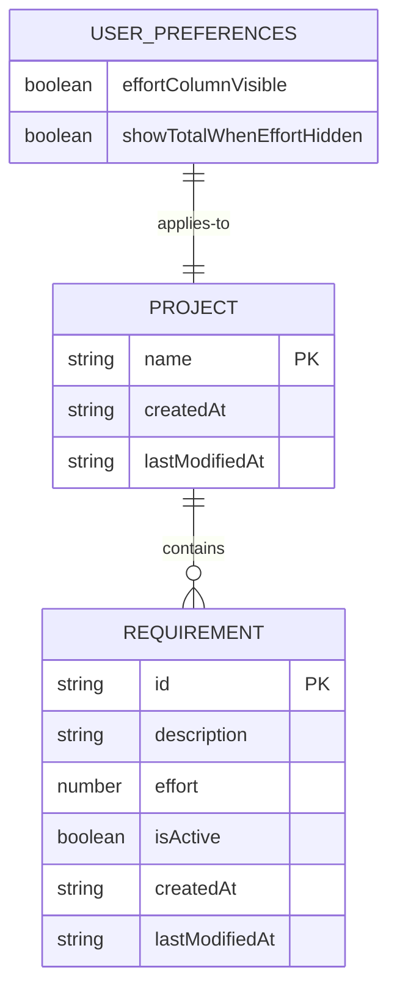

**Relationships:**
- **PROJECT to REQUIREMENT:** One project can have many requirements (1:N)
- **USER_PREFERENCES to PROJECT:** One set of preferences applies to one project (1:1)

**Notes:**
- All relationships are implicit (no foreign keys in localStorage)
- Data is denormalized and stored in separate localStorage keys
- No enforced referential integrity (client-side only)

---

### 5.3 Data Constraints

#### 5.3.1 Project Constraints

| Field | Type | Required | Min | Max | Default |
|-------|------|----------|-----|-----|---------|
| name | string | Yes | 1 char | 100 chars | "Untitled Project" |
| createdAt | ISO 8601 string | Yes | N/A | N/A | `new Date().toISOString()` |
| lastModifiedAt | ISO 8601 string | Yes | N/A | N/A | `new Date().toISOString()` |

**Business Rules:**
- Whitespace-only names treated as empty
- Names are trimmed before storage
- `createdAt` is immutable after creation
- `lastModifiedAt` updates on every name change

---

#### 5.3.2 Requirement Constraints

| Field | Type | Required | Min | Max | Default |
|-------|------|----------|-----|-----|---------|
| id | UUID string | Yes | N/A | N/A | `crypto.randomUUID()` |
| description | string | Yes | 1 char | 500 chars | N/A |
| effort | number | Yes | 0.1 | 1000 | N/A |
| isActive | boolean | Yes | N/A | N/A | `true` |
| createdAt | ISO 8601 string | Yes | N/A | N/A | `new Date().toISOString()` |
| lastModifiedAt | ISO 8601 string | Yes | N/A | N/A | `new Date().toISOString()` |

**Business Rules:**
- IDs are immutable after creation
- Descriptions are trimmed before storage
- Effort values support decimals (e.g., 0.5, 2.5, 13.75)
- New requirements default to active status
- `createdAt` is immutable after creation
- `lastModifiedAt` updates on every edit or status change

---

#### 5.3.3 UserPreferences Constraints

| Field | Type | Required | Default |
|-------|------|----------|---------|
| effortColumnVisible | boolean | Yes | `true` |
| showTotalWhenEffortHidden | boolean | Yes | `true` |

**Business Rules:**
- Both fields must be boolean
- No validation required (always valid booleans)

---

### 5.4 Data Storage Format

**localStorage JSON Structure:**

```json
{
  "req-tracker:schema-version": "1.0.0",

  "req-tracker:project": {
    "name": "Mobile App Development",
    "createdAt": "2025-12-19T10:00:00.000Z",
    "lastModifiedAt": "2025-12-19T10:00:00.000Z"
  },

  "req-tracker:requirements": [
    {
      "id": "a1b2c3d4-e5f6-7890-abcd-ef1234567890",
      "description": "User authentication system",
      "effort": 8,
      "isActive": true,
      "createdAt": "2025-12-19T10:30:00.000Z",
      "lastModifiedAt": "2025-12-19T10:30:00.000Z"
    },
    {
      "id": "b2c3d4e5-f6a7-8901-bcde-f12345678901",
      "description": "Push notification service",
      "effort": 5.5,
      "isActive": true,
      "createdAt": "2025-12-19T11:15:00.000Z",
      "lastModifiedAt": "2025-12-19T11:15:00.000Z"
    },
    {
      "id": "c3d4e5f6-a7b8-9012-cdef-123456789012",
      "description": "Analytics dashboard",
      "effort": 13,
      "isActive": false,
      "createdAt": "2025-12-19T12:00:00.000Z",
      "lastModifiedAt": "2025-12-19T13:45:00.000Z"
    }
  ],

  "req-tracker:preferences": {
    "effortColumnVisible": true,
    "showTotalWhenEffortHidden": true
  }
}
```

---

## 6. Architecture Diagrams

### 6.1 High-Level Component Architecture

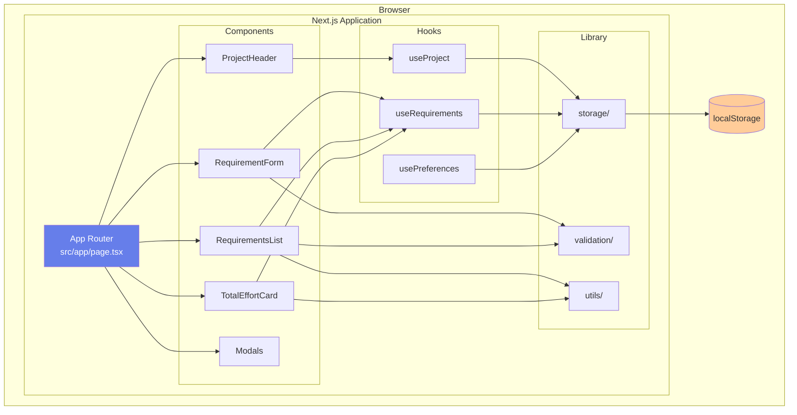

**Architecture Layers:**

1. **Presentation Layer (Components):**
   - React components for UI
   - Handle user interactions
   - Display data

2. **State Management Layer (Hooks):**
   - Custom React hooks
   - Manage component state
   - Coordinate data operations

3. **Business Logic Layer (Library):**
   - Data operations (storage)
   - Validation logic
   - Utility functions

4. **Persistence Layer (localStorage):**
   - Browser localStorage API
   - JSON serialization/deserialization

---

### 6.2 Data Flow Architecture

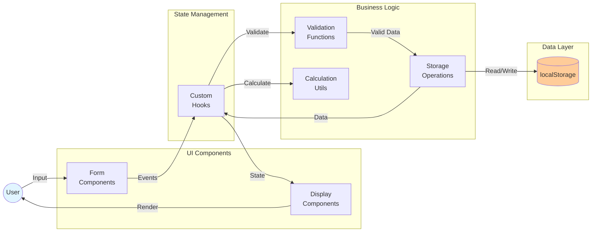

**Data Flow Steps:**

1. **User Input:** User interacts with form components
2. **Event Handling:** Components trigger custom hooks
3. **Validation:** Hooks validate data using validation functions
4. **Storage Operations:** Valid data is saved to localStorage
5. **State Updates:** Hooks update component state with new data
6. **Calculations:** Utils calculate derived values (e.g., total effort)
7. **Rendering:** Display components render updated UI
8. **Display:** User sees updated interface

---

### 6.3 Component Hierarchy

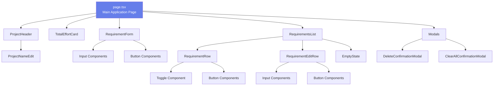

---

### 6.4 State Management Pattern

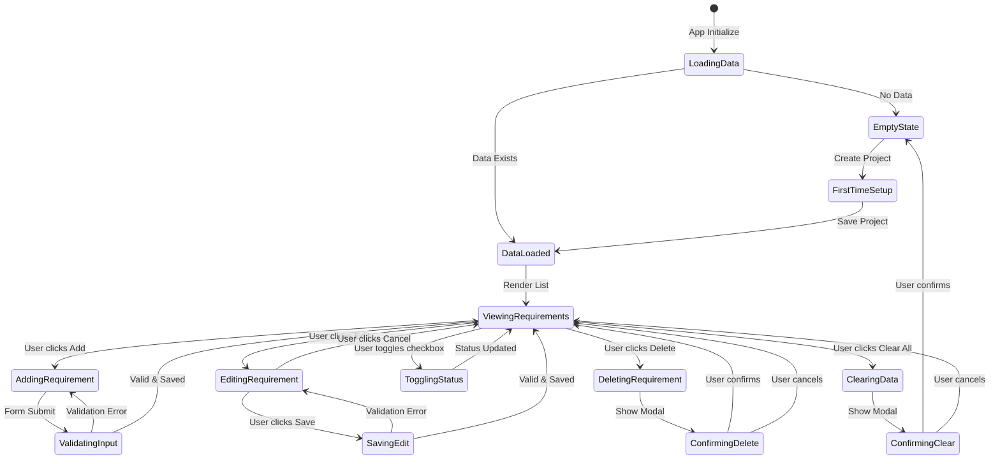

---

## 7. Integration Contracts

### 7.1 Component Props Interfaces

#### 7.1.1 ProjectHeader Component

```typescript
interface ProjectHeaderProps {
  projectName: string;
  onProjectNameUpdate: (newName: string) => void;
  onClearAllClick: () => void;
}
```

**Usage:**
```tsx
<ProjectHeader
  projectName="E-commerce Platform"
  onProjectNameUpdate={(name) => updateProjectName(name)}
  onClearAllClick={() => openClearAllModal()}
/>
```

---

#### 7.1.2 RequirementForm Component

```typescript
interface RequirementFormProps {
  onAddRequirement: (description: string, effort: number) => void;
}
```

**Usage:**
```tsx
<RequirementForm
  onAddRequirement={(desc, effort) => createRequirement(desc, effort)}
/>
```

---

#### 7.1.3 RequirementsList Component

```typescript
interface RequirementsListProps {
  requirements: Requirement[];
  effortColumnVisible: boolean;
  onToggleStatus: (id: string) => void;
  onEdit: (id: string, updates: Partial<Requirement>) => void;
  onDelete: (id: string) => void;
  onToggleEffortVisibility: () => void;
}
```

**Usage:**
```tsx
<RequirementsList
  requirements={requirements}
  effortColumnVisible={preferences.effortColumnVisible}
  onToggleStatus={(id) => toggleStatus(id)}
  onEdit={(id, updates) => updateRequirement(id, updates)}
  onDelete={(id) => deleteRequirement(id)}
  onToggleEffortVisibility={() => toggleEffortColumn()}
/>
```

---

#### 7.1.4 RequirementRow Component

```typescript
interface RequirementRowProps {
  requirement: Requirement;
  effortColumnVisible: boolean;
  isEditing: boolean;
  onToggleStatus: () => void;
  onEdit: () => void;
  onDelete: () => void;
}
```

---

#### 7.1.5 TotalEffortCard Component

```typescript
interface TotalEffortCardProps {
  totalEffort: number;
  visible: boolean;
}
```

**Usage:**
```tsx
<TotalEffortCard
  totalEffort={calculateTotalActiveEffort()}
  visible={preferences.effortColumnVisible || preferences.showTotalWhenEffortHidden}
/>
```

---

#### 7.1.6 Modal Components

```typescript
interface ConfirmationModalProps {
  isOpen: boolean;
  title: string;
  message: string;
  confirmText: string;
  cancelText: string;
  onConfirm: () => void;
  onCancel: () => void;
  variant?: 'danger' | 'warning' | 'info';
}
```

---

### 7.2 Custom Hooks API

#### 7.2.1 useProject Hook

```typescript
interface UseProjectReturn {
  project: Project | null;
  isLoading: boolean;
  updateProjectName: (name: string) => void;
  createProject: (name: string) => void;
}

function useProject(): UseProjectReturn;
```

**Example:**
```typescript
const { project, updateProjectName } = useProject();

// Update project name
updateProjectName("New Project Name");
```

---

#### 7.2.2 useRequirements Hook

```typescript
interface UseRequirementsReturn {
  requirements: Requirement[];
  isLoading: boolean;
  addRequirement: (description: string, effort: number) => void;
  updateRequirement: (id: string, updates: Partial<Requirement>) => void;
  deleteRequirement: (id: string) => void;
  toggleStatus: (id: string) => void;
  totalActiveEffort: number;
}

function useRequirements(): UseRequirementsReturn;
```

**Example:**
```typescript
const {
  requirements,
  addRequirement,
  updateRequirement,
  deleteRequirement,
  toggleStatus,
  totalActiveEffort
} = useRequirements();

// Add new requirement
addRequirement("User login", 5);

// Toggle status
toggleStatus("requirement-id");
```

---

#### 7.2.3 usePreferences Hook

```typescript
interface UsePreferencesReturn {
  preferences: UserPreferences;
  updatePreferences: (updates: Partial<UserPreferences>) => void;
}

function usePreferences(): UsePreferencesReturn;
```

**Example:**
```typescript
const { preferences, updatePreferences } = usePreferences();

// Toggle effort column visibility
updatePreferences({
  effortColumnVisible: !preferences.effortColumnVisible
});
```

---

### 7.3 Shared Constants and Enums

```typescript
/**
 * Validation constraints
 */
export const VALIDATION_CONSTRAINTS = {
  PROJECT_NAME_MIN_LENGTH: 1,
  PROJECT_NAME_MAX_LENGTH: 100,
  REQUIREMENT_DESCRIPTION_MIN_LENGTH: 1,
  REQUIREMENT_DESCRIPTION_MAX_LENGTH: 500,
  EFFORT_MIN_VALUE: 0.1,
  EFFORT_MAX_VALUE: 1000,
} as const;

/**
 * localStorage keys
 */
export const STORAGE_KEYS = {
  SCHEMA_VERSION: 'req-tracker:schema-version',
  PROJECT: 'req-tracker:project',
  REQUIREMENTS: 'req-tracker:requirements',
  PREFERENCES: 'req-tracker:preferences',
} as const;

/**
 * Default values
 */
export const DEFAULTS = {
  PROJECT_NAME: 'Untitled Project',
  REQUIREMENT_STATUS: true,
  EFFORT_COLUMN_VISIBLE: true,
  SHOW_TOTAL_WHEN_HIDDEN: true,
} as const;

/**
 * Error messages
 */
export const ERROR_MESSAGES = {
  DESCRIPTION_REQUIRED: 'Requirement description is required',
  DESCRIPTION_TOO_LONG: 'Description must not exceed 500 characters',
  EFFORT_REQUIRED: 'Effort value is required',
  EFFORT_MUST_BE_NUMBER: 'Effort must be a number',
  EFFORT_MUST_BE_POSITIVE: 'Effort must be greater than 0',
  EFFORT_TOO_LARGE: 'Effort must not exceed 1000',
} as const;
```

---

### 7.4 Event Handlers Type Definitions

```typescript
/**
 * Requirement event handlers
 */
type RequirementEventHandlers = {
  onAdd: (description: string, effort: number) => void;
  onUpdate: (id: string, updates: Partial<Requirement>) => void;
  onDelete: (id: string) => void;
  onToggleStatus: (id: string) => void;
  onEdit: (id: string) => void;
  onCancelEdit: () => void;
};

/**
 * Project event handlers
 */
type ProjectEventHandlers = {
  onNameUpdate: (name: string) => void;
  onClearAll: () => void;
};

/**
 * Preference event handlers
 */
type PreferenceEventHandlers = {
  onToggleEffortVisibility: () => void;
  onToggleTotalVisibility: () => void;
};
```

---

## 8. Development Guidelines

### 8.1 Coding Standards

#### 8.1.1 TypeScript Guidelines

**File Organization:**
```typescript
// 1. External imports
import React from 'react';
import { useState, useEffect } from 'react';

// 2. Internal imports (types)
import type { Requirement } from '@/types/requirement';

// 3. Internal imports (components)
import { Button } from '@/components/UI/Button';

// 4. Internal imports (hooks)
import { useRequirements } from '@/hooks/useRequirements';

// 5. Internal imports (utilities)
import { calculateTotalEffort } from '@/lib/utils/calculations';

// 6. Constants
const MAX_REQUIREMENTS = 100;

// 7. Type definitions
interface ComponentProps {
  // ...
}

// 8. Component definition
export function Component({ ... }: ComponentProps) {
  // ...
}
```

**Type vs Interface:**
```typescript
// Use TYPE for:
// - Union types
type Status = 'active' | 'inactive';

// - Function types
type ValidationFunction = (value: string) => boolean;

// Use INTERFACE for:
// - Object shapes
interface Requirement {
  id: string;
  description: string;
}

// - Component props
interface ButtonProps {
  onClick: () => void;
  children: React.ReactNode;
}
```

**Naming Conventions:**
```typescript
// PascalCase for types, interfaces, components
type RequirementStatus = 'active' | 'inactive';
interface UserPreferences { }
function RequirementRow() { }

// camelCase for variables, functions, methods
const totalEffort = 10;
function calculateTotal() { }

// SCREAMING_SNAKE_CASE for constants
const MAX_EFFORT_VALUE = 1000;
const STORAGE_KEY_PREFIX = 'req-tracker';

// kebab-case for file names (non-components)
utils.ts
calculations.ts
localStorage.ts

// PascalCase for component file names
RequirementRow.tsx
TotalEffortCard.tsx
```

---

#### 8.1.2 React Component Guidelines

**Component Structure:**
```typescript
'use client'; // Only if using client-side features

import React from 'react';
import type { ComponentProps } from './types';

/**
 * Component description
 *
 * @example
 * <RequirementRow requirement={req} onToggle={handleToggle} />
 */
export function RequirementRow({
  requirement,
  onToggle,
}: ComponentProps) {
  // 1. Hooks (order matters)
  const [isEditing, setIsEditing] = useState(false);
  const [value, setValue] = useState('');

  useEffect(() => {
    // Side effects
  }, []);

  // 2. Derived state
  const isActive = requirement.isActive;

  // 3. Event handlers
  const handleEdit = () => {
    setIsEditing(true);
  };

  const handleSave = () => {
    // Save logic
    setIsEditing(false);
  };

  // 4. Early returns
  if (!requirement) {
    return null;
  }

  // 5. Render
  return (
    <div className="requirement-row">
      {/* JSX */}
    </div>
  );
}
```

**Component Best Practices:**
- Use functional components (no class components)
- Always define prop types with TypeScript
- Extract complex logic to custom hooks
- Keep components small and focused (< 200 lines)
- Use composition over inheritance
- Memoize expensive calculations with `useMemo`
- Memoize callback functions with `useCallback` when passing to children

---

#### 8.1.3 Tailwind CSS Guidelines

**Class Organization:**
```tsx
// Order: Layout → Box Model → Typography → Visual → Effects
<div className="
  flex items-center justify-between  // Layout
  p-4 m-2 w-full h-auto              // Box Model
  text-lg font-semibold              // Typography
  bg-white border border-gray-200    // Visual
  rounded-lg shadow-md hover:shadow-lg // Effects
">
```

**Component-Specific Styles:**
```tsx
// Prefer Tailwind utilities
<button className="px-4 py-2 bg-blue-500 text-white rounded">

// Use CSS modules for complex/reusable patterns
import styles from './Button.module.css';
<button className={styles.primaryButton}>

// Avoid inline styles (use only for dynamic values)
<div style={{ width: `${progress}%` }}>
```

**Responsive Design:**
```tsx
// Mobile-first approach
<div className="
  w-full           // Mobile (default)
  md:w-1/2         // Tablet (768px+)
  lg:w-1/3         // Desktop (1024px+)
">
```

---

### 8.2 File Naming Conventions

| File Type | Naming Convention | Example |
|-----------|------------------|---------|
| Components | PascalCase.tsx | `RequirementRow.tsx` |
| Hooks | camelCase.ts | `useRequirements.ts` |
| Utilities | camelCase.ts | `calculations.ts` |
| Types | camelCase.ts | `requirement.ts` |
| Constants | camelCase.ts | `constants.ts` |
| Pages (App Router) | lowercase.tsx | `page.tsx`, `layout.tsx` |
| CSS Modules | PascalCase.module.css | `Button.module.css` |

---

### 8.3 Git Workflow

#### 8.3.1 Branch Naming

```bash
# Feature branches
feature/add-requirement-validation
feature/implement-dark-mode

# Bug fix branches
fix/effort-calculation-rounding
fix/modal-close-button

# Hotfix branches (production issues)
hotfix/critical-storage-bug

# Refactor branches
refactor/extract-validation-logic
refactor/simplify-hooks

# Documentation branches
docs/update-api-specs
docs/add-component-examples
```

#### 8.3.2 Commit Message Format

**Format:**
```
<type>(<scope>): <subject>

<body>

<footer>
```

**Types:**
- `feat`: New feature
- `fix`: Bug fix
- `docs`: Documentation changes
- `style`: Code style changes (formatting, no logic change)
- `refactor`: Code refactoring (no feature change)
- `test`: Adding or updating tests
- `chore`: Maintenance tasks (dependencies, config)

**Examples:**
```bash
feat(requirements): add effort validation with decimal support

- Implement validateEffort function
- Add error messages for invalid inputs
- Support decimal values (0.5, 2.5, etc.)

Closes #42

---

fix(storage): handle corrupted localStorage data

- Add try-catch for JSON.parse operations
- Return default values on parse failure
- Log errors to console for debugging

Fixes #38

---

docs(technical-spec): add sequence diagrams for CRUD operations

- Add mermaid diagrams for all major flows
- Document validation logic
- Update API specifications

---

refactor(hooks): extract common localStorage logic

- Create useLocalStorage generic hook
- Simplify useProject and useRequirements
- Reduce code duplication

---

chore(deps): update Next.js to 15.5.2

- Update Next.js from 15.5.0 to 15.5.2
- Update React to 19.0.1
- Run npm audit fix
```

#### 8.3.3 Branch Workflow

```bash
# 1. Create feature branch from main
git checkout main
git pull origin main
git checkout -b feature/add-requirement-validation

# 2. Make changes and commit
git add .
git commit -m "feat(validation): add requirement validation logic"

# 3. Keep branch up to date
git checkout main
git pull origin main
git checkout feature/add-requirement-validation
git rebase main

# 4. Push to remote
git push origin feature/add-requirement-validation

# 5. Create pull request (via GitHub UI)

# 6. After approval and merge, delete branch
git checkout main
git pull origin main
git branch -d feature/add-requirement-validation
```

---

### 8.4 Code Review Guidelines

#### 8.4.1 Pull Request Checklist

**Before Creating PR:**
- [ ] Code follows TypeScript and React conventions
- [ ] All TypeScript types are properly defined
- [ ] No TypeScript errors or warnings
- [ ] Code is properly formatted (ESLint passing)
- [ ] No console.logs or debugger statements
- [ ] Component props have TypeScript interfaces
- [ ] Functions have clear, descriptive names
- [ ] Complex logic has comments explaining "why"
- [ ] Error handling is implemented where needed
- [ ] Edge cases are considered
- [ ] UI is responsive (mobile and desktop tested)
- [ ] Accessibility considerations (semantic HTML, ARIA labels)

**PR Description Template:**
```markdown
## Description
Brief description of what this PR does

## Changes
- Change 1
- Change 2
- Change 3

## Type of Change
- [ ] Bug fix
- [ ] New feature
- [ ] Refactoring
- [ ] Documentation

## Testing
How to test these changes:
1. Step 1
2. Step 2
3. Expected result

## Screenshots (if UI changes)
[Add screenshots]

## Checklist
- [ ] TypeScript types defined
- [ ] ESLint passing
- [ ] Code follows conventions
- [ ] Responsive design tested
- [ ] Edge cases considered
```

#### 8.4.2 Code Review Focus Areas

**Reviewers should check:**

1. **Correctness:**
   - Does the code do what it's supposed to do?
   - Are there any logical errors?
   - Are edge cases handled?

2. **Type Safety:**
   - Are all types properly defined?
   - No use of `any` type?
   - Proper use of type guards?

3. **Code Quality:**
   - Is the code readable and maintainable?
   - Are functions small and focused?
   - Is there unnecessary complexity?

4. **Performance:**
   - Are there any performance bottlenecks?
   - Unnecessary re-renders?
   - Inefficient algorithms?

5. **Security:**
   - XSS vulnerabilities?
   - Input validation?
   - Proper data sanitization?

6. **Consistency:**
   - Follows project conventions?
   - Consistent naming?
   - Proper file organization?

---

### 8.5 Testing Guidelines

#### 8.5.1 Unit Testing (Future Implementation)

**Test File Structure:**
```typescript
// RequirementRow.test.tsx
import { render, screen, fireEvent } from '@testing-library/react';
import { RequirementRow } from './RequirementRow';

describe('RequirementRow', () => {
  const mockRequirement = {
    id: '123',
    description: 'Test requirement',
    effort: 5,
    isActive: true,
    createdAt: '2025-12-19T10:00:00.000Z',
    lastModifiedAt: '2025-12-19T10:00:00.000Z',
  };

  it('renders requirement description', () => {
    render(<RequirementRow requirement={mockRequirement} />);
    expect(screen.getByText('Test requirement')).toBeInTheDocument();
  });

  it('calls onToggle when checkbox clicked', () => {
    const handleToggle = jest.fn();
    render(
      <RequirementRow
        requirement={mockRequirement}
        onToggle={handleToggle}
      />
    );

    fireEvent.click(screen.getByRole('checkbox'));
    expect(handleToggle).toHaveBeenCalledWith('123');
  });

  it('applies inactive styling when isActive is false', () => {
    const inactiveRequirement = { ...mockRequirement, isActive: false };
    render(<RequirementRow requirement={inactiveRequirement} />);

    const row = screen.getByTestId('requirement-row');
    expect(row).toHaveClass('inactive');
  });
});
```

**Testing Utilities:**
```typescript
// lib/validation/requirementValidation.test.ts
import { validateDescription, validateEffort } from './requirementValidation';

describe('validateDescription', () => {
  it('returns error for empty description', () => {
    const result = validateDescription('');
    expect(result.valid).toBe(false);
    expect(result.error).toBe('Requirement description is required');
  });

  it('returns error for description exceeding 500 characters', () => {
    const longDescription = 'a'.repeat(501);
    const result = validateDescription(longDescription);
    expect(result.valid).toBe(false);
    expect(result.error).toBe('Description must not exceed 500 characters');
  });

  it('returns valid for correct description', () => {
    const result = validateDescription('Valid description');
    expect(result.valid).toBe(true);
    expect(result.error).toBeUndefined();
  });
});

describe('validateEffort', () => {
  it('returns error for negative effort', () => {
    const result = validateEffort(-5);
    expect(result.valid).toBe(false);
    expect(result.error).toBe('Effort must be greater than 0');
  });

  it('returns valid for decimal effort', () => {
    const result = validateEffort(5.5);
    expect(result.valid).toBe(true);
    expect(result.value).toBe(5.5);
  });

  it('returns error for effort exceeding 1000', () => {
    const result = validateEffort(1001);
    expect(result.valid).toBe(false);
    expect(result.error).toBe('Effort must not exceed 1000');
  });
});
```

---

## 9. Appendix

### 9.1 Browser Compatibility

**Supported Browsers:**
| Browser | Minimum Version | Notes |
|---------|----------------|-------|
| Chrome | 90+ | Recommended |
| Firefox | 88+ | Fully supported |
| Safari | 14+ | Fully supported |
| Edge | 90+ | Chromium-based |
| Mobile Safari | iOS 14+ | Touch-optimized |
| Chrome Mobile | 90+ | Touch-optimized |

**Required Browser Features:**
- localStorage API
- ES2020+ JavaScript features
- CSS Grid and Flexbox
- fetch API
- Promise API
- async/await
- Crypto API (for UUID generation)

---

### 9.2 Performance Targets

**Loading Performance:**
- First Contentful Paint (FCP): < 1.5s
- Largest Contentful Paint (LCP): < 2.5s
- Time to Interactive (TTI): < 3.0s
- Cumulative Layout Shift (CLS): < 0.1

**Runtime Performance:**
- Form input response: < 50ms
- List rendering (100 items): < 200ms
- Total effort calculation: < 10ms
- Modal open/close animation: 300ms

**Bundle Size Targets:**
- JavaScript bundle: < 200 KB (gzipped)
- CSS bundle: < 50 KB (gzipped)
- Total page weight: < 300 KB (excluding images)

---

### 9.3 Accessibility Requirements

**WCAG 2.1 Level AA Compliance:**
- ✅ Keyboard navigation support (Tab, Enter, Escape)
- ✅ Focus indicators on interactive elements
- ✅ Sufficient color contrast (4.5:1 for text)
- ✅ Semantic HTML elements
- ✅ ARIA labels for icon buttons
- ✅ Form validation error messages
- ✅ Screen reader friendly

**Keyboard Shortcuts:**
| Key | Action |
|-----|--------|
| Tab | Navigate between fields/buttons |
| Enter | Submit form / Save edit |
| Escape | Cancel edit / Close modal |
| Space | Toggle checkboxes |

---

### 9.4 Security Considerations

**Client-Side Security:**
1. **XSS Prevention:**
   - React's built-in XSS protection (no `dangerouslySetInnerHTML`)
   - Input sanitization (trim, length validation)
   - Escape HTML entities in user-generated content

2. **Content Security Policy:**
   ```typescript
   // next.config.ts
   headers: async () => [
     {
       source: '/:path*',
       headers: [
         { key: 'X-Frame-Options', value: 'DENY' },
         { key: 'X-Content-Type-Options', value: 'nosniff' },
         { key: 'X-XSS-Protection', value: '1; mode=block' },
         { key: 'Referrer-Policy', value: 'strict-origin-when-cross-origin' },
         {
           key: 'Content-Security-Policy',
           value: "default-src 'self'; script-src 'self' 'unsafe-inline' 'unsafe-eval'; style-src 'self' 'unsafe-inline';"
         }
       ]
     }
   ]
   ```

3. **Data Privacy:**
   - No sensitive data stored (no PII, passwords, credentials)
   - All data stored locally in user's browser
   - No data transmission to external servers
   - Clear user communication about data storage

---

### 9.5 Future Enhancements Roadmap

**Phase 2: Enhanced Features (Months 2-3)**
- Export requirements to CSV/JSON
- Import requirements from file
- Requirement sorting (by effort, date, status)
- Requirement filtering
- Search functionality
- Keyboard shortcuts documentation

**Phase 3: Backend Integration (Months 4-6)**
- User authentication
- Cloud data sync
- Multi-user collaboration
- Requirement history/versioning
- Comments on requirements

**Phase 4: Advanced Features (Months 6+)**
- Dark mode theme
- Custom effort units
- Requirement categories/tags
- Gantt chart visualization
- Reports and analytics
- Mobile app (React Native)

---

### 9.6 Known Limitations

**Current MVP Limitations:**
1. **No multi-user support:** Single-user application
2. **No cloud backup:** Data only in browser localStorage
3. **No data export:** Cannot export to external formats
4. **No search/filter:** Manual browsing of requirements
5. **No undo/redo:** No action history
6. **No requirement history:** No change tracking
7. **No attachment support:** Text-only requirements
8. **localStorage size limit:** ~5-10 MB browser limit
9. **No offline indicator:** Assumes browser always works
10. **No internationalization:** English only

---

### 9.7 Troubleshooting Guide

**Common Issues:**

| Issue | Cause | Solution |
|-------|-------|----------|
| Data not persisting | localStorage disabled | Enable localStorage in browser settings |
| Data disappeared | localStorage cleared | Inform user about browser data clearing |
| Validation not working | JavaScript disabled | Enable JavaScript |
| Styling broken | CSS not loading | Clear browser cache |
| App not loading | Old browser version | Update browser to supported version |
| Form not submitting | Network error (shouldn't happen) | Refresh page |

---

### 9.8 Glossary

| Term | Definition |
|------|------------|
| **App Router** | Next.js 13+ routing system using `app/` directory |
| **Client Component** | React component that runs in browser (uses 'use client') |
| **Server Component** | React component that renders on server (default in Next.js 15+) |
| **localStorage** | Browser API for storing key-value pairs persistently |
| **SSR** | Server-Side Rendering |
| **CSR** | Client-Side Rendering |
| **Turbopack** | Next.js build tool (successor to Webpack) |
| **Tailwind CSS** | Utility-first CSS framework |
| **TypeScript** | Typed superset of JavaScript |
| **UUID** | Universally Unique Identifier |
| **ISO 8601** | International standard for date/time format |

---

### 9.9 References

**Official Documentation:**
- Next.js: https://nextjs.org/docs
- React: https://react.dev
- TypeScript: https://www.typescriptlang.org/docs
- Tailwind CSS: https://tailwindcss.com/docs
- MDN Web APIs: https://developer.mozilla.org/en-US/docs/Web/API

**Project Documentation:**
- Functional Requirements: `docs/requirement.md`
- Data Schema: `docs/data-schema.md`
- Architecture Design: `docs/architecture.md`
- UI Prototypes: `ui-prototypes/README.md`

---

## Revision History

| Version | Date | Author | Changes |
|---------|------|--------|---------|
| 1.0 | 2025-12-19 | Development Team | Initial comprehensive technical specification |

---

**Document Status:** ✅ Complete and Ready for Development

**Next Steps:**
1. Review technical specification with team
2. Create GitHub issues for each component
3. Set up project structure
4. Implement data layer (types, storage, hooks)
5. Implement components (UI → integration)
6. Conduct code reviews
7. Deploy to production

---

**End of Technical Specification Document**
