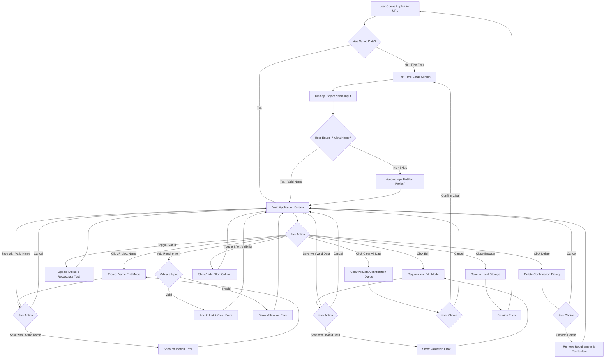

# UX/UI Requirements Document
## Requirement & Effort Tracker MVP

**Document Version:** 2.0
**Date:** 2025-12-19
**Status:** Updated to reflect implemented HTML prototypes
**Purpose:** This document defines the user experience and interface requirements for the Requirement & Effort Tracker MVP, updated to accurately reflect the HTML prototypes created by the UI/UX team.

---

## Table of Contents
1. [Complete User Flow Diagram](#1-complete-user-flow-diagram)
2. [Visual Design System](#2-visual-design-system)
3. [Screen-by-Screen Breakdown](#3-screen-by-screen-breakdown)
4. [Global UI Behaviors](#4-global-ui-behaviors)
5. [Interaction Patterns Summary](#5-interaction-patterns-summary)
6. [Implementation Notes](#6-implementation-notes)

---

## 1. Complete User Flow Diagram



### User Flow Description

**Primary Flow (New User):**
1. User navigates to application URL (no authentication required)
2. Application checks for existing data in local storage
3. If no data exists, display project name input
4. User enters project name or skips (defaults to "Untitled Project")
5. Main application screen loads with empty requirements list
6. User adds requirements using the form
7. Each addition updates the display and saves to local storage
8. User can manage requirements (edit, delete, toggle status)
9. All changes persist automatically

**Secondary Flow (Returning User):**
1. User navigates to application URL
2. Application detects existing data in local storage
3. Main application screen loads with saved data
4. User continues managing their project
5. All changes persist automatically

**Alternative Paths:**
- Edit project name at any time from main screen
- Toggle effort column visibility to hide/show effort values
- Clear all data to start fresh project
- Toggle individual requirement status to include/exclude from total

---

## 2. Visual Design System

This section documents the actual visual design implementation from the HTML prototypes.

### 2.1 Color Palette

**Primary Colors:**
- Primary Gradient: `linear-gradient(135deg, #667eea 0%, #764ba2 100%)`
  - Start: `#667eea` (Purple-Blue)
  - End: `#764ba2` (Purple)
- Primary Solid: `#667eea` (used for focus states, toggles)

**Neutral Colors:**
- Dark Text: `#2d3748` (headings, primary text)
- Medium Text: `#4a5568` (labels, secondary text)
- Light Text: `#718096` (placeholder text, disabled text)
- Border Light: `#e2e8f0` (input borders, dividers)
- Border Medium: `#cbd5e0` (hover states)
- Background Light: `#f7fafc` (hover backgrounds, inactive states)

**Semantic Colors:**
- Error/Danger: `#e53e3e` (error messages, delete actions)
- Error Background: `#fff5f5` (error button backgrounds)
- Error Border: `#fed7d7` (error button borders)
- Error Hover: `#fc8181` (error button hover borders)

**Surface Colors:**
- Card Background: `rgba(255, 255, 255, 0.95)` with `backdrop-filter: blur(10px)` (glassmorphism)
- Input Background: `white` (solid white)
- Hover Background: `#f7fafc` (light gray)
- Edit Row Background: `#f7fafc` (light gray)

### 2.2 Typography

**Font Family:**
```css
font-family: -apple-system, BlinkMacSystemFont, 'Segoe UI', Roboto, 'Helvetica Neue', Arial, sans-serif;
```

**Font Sizes:**
- Extra Large: `48px` (total effort value, logo emoji)
- Large: `32px` (main headings, project name)
- Medium: `24px` (modal headings)
- Regular: `20px` (section headings)
- Base: `16px` (body text, inputs, labels)
- Small: `14px` (labels, small buttons, error messages)
- Extra Small: `13px` (icon button text)

**Font Weights:**
- Bold: `700` (main headings)
- Semi-Bold: `600` (labels, buttons, subheadings)
- Medium: `500` (total effort label)
- Regular: `400` (body text)

**Line Heights:**
- Standard: `1.5` (body text, descriptions)
- Tight: `1.4` (warning text)

### 2.3 Spacing System

**Padding:**
- Cards (Desktop): `30px 40px` or `60px 40px` (setup screen)
- Cards (Mobile): `20px` or `40px 24px` (setup screen)
- Inputs: `12px 16px` or `14px 16px`
- Buttons: `12px 24px` (regular), `14px 24px` (large), `8px 16px` (small), `6px 12px` (icon)
- Table Cells: `12px` (headers), `16px 12px` (body)
- Modal: `40px` (desktop), `30px 20px` (mobile)

**Margins:**
- Between Cards: `20px`
- Between Sections: `20px` - `30px`
- Form Group Bottom: `16px` - `30px`
- Element Gaps: `8px`, `12px`, `20px`

**Container Widths:**
- Setup Card Max Width: `500px`
- Main Container Max Width: `1200px`
- Modal Max Width: `500px`

### 2.4 Border Radius

- Large Cards: `20px`
- Inputs/Buttons: `12px`
- Small Buttons: `10px`
- Icon Buttons: `8px`
- Toggle Switch: `13px` (pill shape)
- Badge: `12px`

### 2.5 Shadows

**Card Shadows:**
- Standard: `0 10px 40px rgba(0, 0, 0, 0.2)`
- Deep: `0 20px 60px rgba(0, 0, 0, 0.3)` (setup screen, modals)

**Button Shadows:**
- Primary: `0 4px 15px rgba(102, 126, 234, 0.4)`
- Primary Hover: `0 6px 20px rgba(102, 126, 234, 0.5)`
- Danger: `0 4px 15px rgba(229, 62, 62, 0.4)`

**Focus Shadows:**
- Input Focus: `0 0 0 3px rgba(102, 126, 234, 0.1)`

**Element Shadows:**
- Toggle Slider: `0 2px 4px rgba(0, 0, 0, 0.2)`

### 2.6 Transitions

**Standard Transitions:**
```css
transition: all 0.3s ease;
```

**Applied To:**
- Buttons (hover, active states)
- Inputs (focus states)
- Table rows (hover)
- Links (hover)
- Toggle switches
- Modal overlays
- Icon buttons

### 2.7 Animations

**Fade In Up (Setup Screen):**
```css
@keyframes fadeInUp {
    from {
        opacity: 0;
        transform: translateY(30px);
    }
    to {
        opacity: 1;
        transform: translateY(0);
    }
}
animation: fadeInUp 0.6s ease;
```

**Modal Slide In:**
```css
@keyframes modalSlideIn {
    from {
        opacity: 0;
        transform: scale(0.9);
    }
    to {
        opacity: 1;
        transform: scale(1);
    }
}
animation: modalSlideIn 0.3s ease;
```

**Hover Transforms:**
- Button Lift: `translateY(-2px)` (on hover)
- Button Reset: `translateY(0)` (on active)

### 2.8 Responsive Breakpoints

**Mobile (max-width: 768px):**
- Card padding reduced to `20px`
- Project name font size: `24px` → `26px` (setup)
- Button groups: flex-direction changes to column
- Modal padding reduced to `30px 20px`
- Grid layouts change to single column

**Small Mobile (max-width: 600px):**
- Setup card padding: `40px 24px`
- Main heading: `26px`
- Button groups: stacked vertically

---

## 3. Screen-by-Screen Breakdown

### Screen 1: First-Time Setup Screen

**File:** `01-first-time-setup.html`

**Screen Name:** First-Time Project Setup

**Screen Purpose:**
Displayed only when no saved data exists in local storage. Captures initial project name and transitions user to the main application interface.

**Visual Layout:**
- Centered card design (max-width: 500px)
- Glassmorphism effect: semi-transparent white card with backdrop blur
- Purple gradient background covering full viewport
- Vertically and horizontally centered on screen
- Fade-up animation on load (0.6s)

**Visual Elements:**

**Logo/Icon:**
- Emoji: 📋 (clipboard)
- Size: 48px
- Position: Top center of card
- Margin below: 20px

**Heading:**
- Text: "Welcome!"
- Font size: 32px (desktop), 26px (mobile)
- Font weight: 700 (bold)
- Color: `#2d3748` (dark gray)
- Margin bottom: 12px

**Subtitle:**
- Text: "Let's get started by giving your project a name. You can always change it later."
- Font size: 16px
- Color: `#718096` (medium gray)
- Line height: 1.5
- Margin bottom: 40px

**User Interactions:**
- Enter text into project name input field
- Click/tap "Continue" button to proceed
- Click/tap "Skip for now" link to use default name
- Press Enter key in input field to proceed (keyboard shortcut)

**Input Fields:**

| Field Name | Type | Required | Validation Rules | Default Value | Placeholder Text |
|------------|------|----------|------------------|---------------|------------------|
| Project Name | Text (single-line) | No (can skip) | - Max 100 characters<br>- Cannot be only whitespace<br>- If empty or whitespace only, defaults to "Untitled Project"<br>- Special characters allowed | "Untitled Project" (if skipped) | "Enter your project name" |

**Input Field Styling:**
- Width: 100%
- Padding: 14px 16px
- Border: 2px solid `#e2e8f0`
- Border radius: 12px
- Font size: 16px
- Background: white
- Focus state: Border `#667eea`, shadow `0 0 0 3px rgba(102, 126, 234, 0.1)`

**Buttons:**

**Primary Button ("Continue"):**
- Style: Full-width button in flex container
- Padding: 14px 24px
- Border radius: 12px
- Font size: 16px
- Font weight: 600
- Background: Linear gradient `#667eea` to `#764ba2`
- Color: white
- Shadow: `0 4px 15px rgba(102, 126, 234, 0.4)`
- Hover: Lift up 2px, shadow `0 6px 20px rgba(102, 126, 234, 0.5)`
- Active: Reset to position 0

**Skip Link:**
- Text: "Skip for now (will use "Untitled Project")"
- Font size: 14px
- Color: `#718096` (medium gray)
- Position: Below button (20px margin top)
- Center aligned
- Hover: Color changes to `#667eea`, underline appears
- No border or background

**Navigation:**
- **From:** Application entry point (URL)
- **To:** Main Application Screen (02-main-application.html)
- **Trigger:** User clicks Continue button OR presses Enter in input field OR clicks Skip link
- **Transition:** Page navigation (href or window.location)

**Error States:**
- **Project name exceeds 100 characters:**
  - Error message: "Project name must not exceed 100 characters"
  - Display: Below input field
  - Font size: 14px
  - Color: `#e53e3e` (red)
  - Margin top: 8px
  - Initially hidden (display: none), shows when validation fails
  - Behavior: Prevent proceeding until corrected

**Error Message Behavior:**
- Hidden by default
- Appears on submit if validation fails
- Clears on input (as user types)

**Success States:**
- **Valid project name entered:**
  - Success indicator: None (immediate transition)
  - Action: Save to localStorage, redirect to main application
- **User skips naming:**
  - Success indicator: None (immediate transition)
  - Action: Save "Untitled Project" to localStorage, redirect to main application

**Data Persistence:**
- Project name saved to `localStorage` with key `'projectName'`
- Saves immediately before navigation

**Responsive Behavior:**
- Mobile (≤600px): Card padding reduces to 40px 24px, heading size 26px, buttons stack vertically

---

### Screen 2: Main Application Screen

**File:** `02-main-application.html`

**Screen Name:** Main Application Screen (Dashboard)

**Screen Purpose:**
Primary interface where users manage their project. Displays project name, requirement list, add requirement form, total effort calculation, and all management controls.

**Visual Layout:**
- Full viewport with purple gradient background
- Container: max-width 1200px, centered
- Padding: 20px around container
- Multiple card sections stacked vertically with 20px gaps:
  1. Header card (project name + controls)
  2. Total effort card (gradient)
  3. Add requirement form card
  4. Requirements list card

**Section 1: Header Card**

**Visual Styling:**
- Background: `rgba(255, 255, 255, 0.95)` with backdrop blur
- Border radius: 20px
- Padding: 30px 40px (desktop), 20px (mobile)
- Shadow: `0 10px 40px rgba(0, 0, 0, 0.2)`
- Layout: Flexbox, space-between, wrap enabled
- Gap: 20px

**Project Name Display (Normal State):**
- Font size: 32px (desktop), 24px (mobile)
- Font weight: 700
- Color: `#2d3748`
- Cursor: pointer
- Padding: 8px 12px
- Border radius: 8px
- Display: Flex with gap 10px
- Edit icon: ✏️ (20px, 50% opacity)
- Hover: Background `rgba(102, 126, 234, 0.1)`, color `#667eea`
- Transition: all 0.3s ease

**Project Name Edit Mode:**
- Display: Flex with gap 12px
- Input flex: 1
- Input padding: 12px 16px
- Input border: 2px solid `#667eea`
- Input border radius: 12px
- Input font size: 18px
- Input font weight: 600
- Buttons: "Save" (primary) and "Cancel" (secondary)
- Button size: Small (8px 16px padding, 14px font)

**Clear All Data Button:**
- Background: white
- Color: `#e53e3e` (red)
- Border: 2px solid `#fed7d7` (light red)
- Padding: 10px 20px
- Border radius: 10px
- Font size: 14px
- Font weight: 600
- Icon: 🗑️ emoji prefix
- Hover: Background `#fff5f5`, border `#fc8181`

**Section 2: Total Effort Card**

**Visual Styling:**
- Background: Linear gradient `#667eea` to `#764ba2`
- Border radius: 20px
- Padding: 30px 40px (desktop), 20px (mobile)
- Shadow: `0 10px 40px rgba(0, 0, 0, 0.2)`
- Color: white
- Text align: center
- Can be hidden via `.hidden` class (display: none)

**Content:**
- Label: "Total Active Effort"
  - Font size: 16px
  - Opacity: 0.9
  - Font weight: 500
  - Margin bottom: 8px
- Value: Dynamic number (e.g., "27.50")
  - Font size: 48px
  - Font weight: 700
  - Format: 2 decimal places

**Section 3: Add Requirement Form Card**

**Visual Styling:**
- Background: `rgba(255, 255, 255, 0.95)` with backdrop blur
- Border radius: 20px
- Padding: 30px 40px (desktop), 20px (mobile)
- Shadow: `0 10px 40px rgba(0, 0, 0, 0.2)`

**Heading:**
- Text: "Add New Requirement"
- Font size: 20px
- Font weight: 600
- Color: `#2d3748`
- Margin bottom: 20px

**User Interactions:**
- Enter text into requirement description field (textarea)
- Enter numeric value into effort field (number input)
- Click/tap "Add Requirement" button
- Press Enter in either field to submit
- Tab between fields for keyboard navigation

**Input Fields:**

| Field Name | Type | Required | Validation Rules | Default Value | Placeholder Text |
|------------|------|----------|------------------|---------------|------------------|
| Requirement Description | Textarea (multiline) | Yes | - Cannot be empty or only whitespace<br>- Max 500 characters<br>- Special characters allowed | Empty | "Enter requirement description" |
| Effort | Number | Yes | - Must be numeric<br>- Must be greater than 0<br>- Max value: 1000<br>- Decimals allowed (step="0.1") | Empty | "0.0" |

**Form Layout:**
- Grid layout for desktop: 2 rows
- Row 1: Description field (full width, grid-column: 1 / -1)
- Row 2: Effort field + Add button (2 columns with auto sizing)
- Gap: 12px
- Mobile: Stacks to single column

**Input Field Styling:**

**Textarea (Description):**
- Width: 100%
- Padding: 12px 16px
- Border: 2px solid `#e2e8f0`
- Border radius: 12px
- Font size: 16px
- Font family: Inherited
- Background: white
- Resize: vertical
- Min height: 60px
- Focus: Border `#667eea`, shadow `0 0 0 3px rgba(102, 126, 234, 0.1)`
- Error state: Border `#e53e3e` (red)

**Number Input (Effort):**
- Same styling as textarea
- Type: number
- Step: 0.1
- Min: 0.1
- Max: 1000
- Width: auto (fits grid)

**Label Styling:**
- Display: block
- Color: `#4a5568` (dark gray)
- Font weight: 600
- Font size: 14px
- Margin bottom: 8px

**Error Message Styling:**
- Color: `#e53e3e` (red)
- Font size: 13px
- Display: none (default)
- Shows when validation fails (display: block)
- Positioned below respective field

**Add Button:**
- Background: Linear gradient `#667eea` to `#764ba2`
- Color: white
- Padding: 12px 24px
- Border radius: 12px
- Font size: 16px
- Font weight: 600
- Shadow: `0 4px 15px rgba(102, 126, 234, 0.4)`
- Hover: Lift 2px, shadow `0 6px 20px rgba(102, 126, 234, 0.5)`
- Position: Aligned to flex-end (bottom of effort field row)
- Margin bottom: 24px (to align with input field)

**Dependencies:**
- Both fields must be valid for submission
- After successful addition, both fields clear
- Focus returns to description field automatically

**Section 4: Requirements List Card**

**Visual Styling:**
- Background: `rgba(255, 255, 255, 0.95)` with backdrop blur
- Border radius: 20px
- Padding: 30px 40px (desktop), 20px (mobile)
- Shadow: `0 10px 40px rgba(0, 0, 0, 0.2)`

**Requirements Header:**
- Layout: Flexbox, space-between, wrap enabled
- Gap: 12px
- Margin bottom: 20px

**Heading:**
- Text: "Requirements"
- Font size: 20px
- Font weight: 600
- Color: `#2d3748`

**Effort Visibility Toggle:**
- Layout: Flex, gap 8px
- Cursor: pointer
- User-select: none

**Toggle Switch Component:**
- Width: 50px
- Height: 26px
- Background: `#cbd5e0` (inactive), `#667eea` (active)
- Border radius: 13px (pill)
- Position: relative
- Transition: all 0.3s ease

**Toggle Slider:**
- Width: 22px
- Height: 22px
- Background: white
- Border radius: 50% (circle)
- Position: absolute, top 2px, left 2px (inactive) or 26px (active)
- Shadow: `0 2px 4px rgba(0, 0, 0, 0.2)`
- Transition: all 0.3s ease

**Toggle Label:**
- Text: "Hide Effort" (when visible) or "Show Effort" (when hidden)
- Font size: 14px
- Color: `#4a5568`

**Requirements Table:**

**Table Structure:**
- Width: 100%
- Border collapse: collapse

**Table Head:**
- Border bottom: 2px solid `#e2e8f0`
- Columns:
  1. "Active" (width: 50px)
  2. "Description" (flexible width)
  3. "Effort" (width: 120px, can be hidden)
  4. "Actions" (width: 140px)

**Table Header Cells:**
- Text align: left
- Padding: 12px
- Color: `#4a5568`
- Font weight: 600
- Font size: 14px

**Table Body Rows:**
- Border bottom: 1px solid `#e2e8f0`
- Transition: all 0.3s ease
- Hover: Background `#f7fafc` (light gray)
- Inactive class: Opacity 0.5

**Table Body Cells:**
- Padding: 16px 12px
- Color: `#2d3748`

**Status Toggle (Checkbox):**
- Width: 20px
- Height: 20px
- Cursor: pointer
- Accent color: `#667eea` (custom browser checkbox color)
- Type: checkbox
- Checked: Active requirement
- Unchecked: Inactive requirement

**Requirement Description:**
- Word break: break-word (handles long text)
- Full text display

**Effort Value:**
- Format: 2 decimal places (e.g., "12.50")
- Column can be hidden via toggle

**Action Buttons:**
- Layout: Flex, gap 8px

**Edit Button:**
- Padding: 6px 12px
- Border: none
- Border radius: 8px
- Font size: 13px
- Font weight: 600
- Background: `#edf2f7` (light gray)
- Color: `#667eea` (purple)
- Cursor: pointer
- Hover: Background `#e6f2ff` (light blue)

**Delete Button:**
- Padding: 6px 12px
- Border: none
- Border radius: 8px
- Font size: 13px
- Font weight: 600
- Background: `#fff5f5` (light red)
- Color: `#e53e3e` (red)
- Cursor: pointer
- Hover: Background `#fed7d7` (medium red)

**Empty State:**

**When No Requirements Exist:**
- Text align: center
- Padding: 60px 20px
- Color: `#718096` (medium gray)

**Icon:**
- Emoji: 📝 (memo)
- Font size: 64px
- Margin bottom: 16px
- Opacity: 0.5

**Message:**
- Text: "No requirements yet. Add your first requirement above."
- Font size: 18px
- Line height: 1.5

**User Interactions:**

**Requirements List:**
- Click/tap checkbox to toggle Active/Inactive status
- Click/tap "Edit" button to enter inline edit mode
- Click/tap "Delete" button to show delete confirmation modal
- Hover over rows for visual feedback
- Scroll if many requirements exist

**Display Controls:**
- Click/tap toggle switch to hide/show effort column
- Toggle switch changes state immediately
- Label text updates to reflect state
- Column visibility changes immediately

**Navigation:**
- **From:** First-Time Setup Screen OR returning user entry point
- **To:**
  - Project Name Edit Mode (inline, same screen)
  - Requirement Edit Mode (inline, same screen)
  - Delete Confirmation Dialog (modal overlay)
  - Clear All Data Confirmation Dialog (modal overlay)
- **Refresh/Reload:** Stays on Main Application Screen with persisted data
- **Close/Reopen Browser:** Returns to Main Application Screen with persisted data

**Error States:**

**Add Requirement - Description Validation:**
- **Empty description:**
  - Error message: "Requirement description is required"
  - Display: Below description field
  - Color: `#e53e3e`, size: 13px
  - Timing: On submit attempt
  - Field border changes to red
- **Description exceeds 500 characters:**
  - Error message: "Description must not exceed 500 characters"
  - Same styling and behavior as above

**Add Requirement - Effort Validation:**
- **Empty effort:**
  - Error message: "Effort value is required"
  - Display: Below effort field
- **Non-numeric effort:**
  - Error message: "Effort must be a number"
- **Zero or negative effort:**
  - Error message: "Effort must be greater than 0"
- **Effort exceeds 1000:**
  - Error message: "Effort must not exceed 1000"

**Multiple Validation Errors:**
- Both description and effort errors can display simultaneously
- Each appears below respective field

**Error Message Behavior:**
- Hidden by default (display: none)
- Shows on submit if validation fails (display: block)
- Clears on input (when user starts typing)
- Associated field gets red border (class: error)

**Success States:**

**Add Requirement Success:**
- No explicit success indicator
- Immediate visual feedback:
  - New requirement appears at bottom of list
  - Both input fields clear
  - Focus returns to description field
  - Total effort updates if requirement is active
  - Data saved to localStorage automatically

**Toggle Status Success:**
- Checkbox state changes immediately (checked/unchecked)
- Row opacity changes (50% if inactive, 100% if active)
- Total effort recalculates and updates immediately
- Data saved to localStorage automatically

**Toggle Effort Visibility Success:**
- Column appears/disappears immediately
- Toggle switch animates to new position
- Toggle slider moves left/right
- Toggle label text updates
- Switch background color changes
- Preference saved to localStorage

---

### Screen 3: Project Name Edit Mode

**Implementation:** Inline edit mode within main application screen

**Visual State:**
- Project name display is hidden
- Edit form is shown (flex display)
- Input field is pre-filled with current project name
- Input has focus and text is selected (for easy overwriting)
- Two buttons: "Save" (primary) and "Cancel" (secondary)

**Component Details:**

**Input Field:**
- Flex: 1 (takes available space)
- Padding: 12px 16px
- Border: 2px solid `#667eea` (always active color)
- Border radius: 12px
- Font size: 18px
- Font weight: 600
- Box shadow: `0 0 0 3px rgba(102, 126, 234, 0.1)` (focus ring)
- Pre-filled with current value
- Auto-focused
- Text selected

**Save Button:**
- Style: Primary button (gradient)
- Size: Small (8px 16px padding, 14px font)
- Text: "Save"

**Cancel Button:**
- Style: Secondary button (white with border)
- Size: Small (8px 16px padding, 14px font)
- Text: "Cancel"

**User Interactions:**
- Type new project name in text field
- Click "Save" to confirm changes
- Click "Cancel" to discard changes
- Press Enter to save (keyboard shortcut)
- Press Escape to cancel (keyboard shortcut)
- Click outside edit area to cancel (optional)

**Validation:**
- Max 100 characters
- Cannot be only whitespace
- If empty/whitespace: Error message "Project name cannot be empty"
- If > 100 chars: Error message "Project name must not exceed 100 characters"

**Error Display:**
- Below or adjacent to input field
- Font size: 14px
- Color: `#e53e3e`
- Prevents saving until corrected

**Exit Behavior:**
- **Save Success:** Edit mode closes, project name updates, data saved to localStorage
- **Cancel:** Edit mode closes, original name restored, no data changes

---

### Screen 4: Requirement Edit Mode

**Implementation:** Inline edit mode within requirements table row

**Visual State:**
- Row background changes to `#f7fafc` (light gray) with class "edit-row"
- Status checkbox remains visible but disabled
- Description and effort cells merge (colspan="3")
- Edit form appears inline

**Edit Form Layout:**
- Display: Flex
- Gap: 12px
- Align items: flex-start

**Components:**

**Textarea (Description):**
- Flex: 1 (takes most space)
- Padding: 8px 12px
- Border: 2px solid `#667eea` (active color)
- Border radius: 8px
- Font size: 14px
- Font family: Inherited
- Resize: vertical
- Min height: 60px
- Box shadow: `0 0 0 3px rgba(102, 126, 234, 0.1)`
- Pre-filled with current value
- Auto-focused

**Number Input (Effort):**
- Width: 100px (fixed)
- Padding: 8px 12px
- Border: 2px solid `#667eea`
- Border radius: 8px
- Font size: 14px
- Box shadow: `0 0 0 3px rgba(102, 126, 234, 0.1)`
- Pre-filled with current value
- Type: number, step: 0.1

**Action Buttons:**
- Display: Flex
- Gap: 8px
- Flex direction: column (desktop), row (mobile)

**Save Button:**
- Style: Primary (gradient)
- Size: Small (8px 16px padding, 13px font)
- Text: "Save"

**Cancel Button:**
- Style: Secondary (white with border)
- Size: Small (8px 16px padding, 13px font)
- Text: "Cancel"

**Behavior:**
- Only one requirement can be in edit mode at a time
- Clicking "Edit" on another requirement cancels current edit
- Delete and other row buttons hidden or disabled during edit

**User Interactions:**
- Type new description in textarea
- Type new effort value in number field
- Click "Save" to confirm changes
- Click "Cancel" to discard changes
- Press Enter to save
- Press Escape to cancel
- Tab between fields

**Validation:**
- Same rules as add requirement form
- Errors shown inline within edit row
- Prevents saving until corrected

**Exit Behavior:**
- **Save Success:** Row returns to display mode with updated values, total recalculates, data saved
- **Cancel:** Row returns to display mode with original values, no changes

---

### Screen 5: Delete Confirmation Dialog

**Implementation:** Modal overlay

**Modal Overlay:**
- Position: fixed, top/left/right/bottom: 0
- Background: `rgba(0, 0, 0, 0.5)` (50% black)
- Display: Flex (when shown), aligned center, justified center
- Z-index: 1000
- Padding: 20px
- Click outside to close (optional)

**Modal Box:**
- Background: white (solid)
- Border radius: 20px
- Padding: 40px (desktop), 30px 20px (mobile)
- Max width: 500px
- Width: 100%
- Shadow: `0 20px 60px rgba(0, 0, 0, 0.3)`
- Animation: modalSlideIn 0.3s ease

**Animation:**
```css
@keyframes modalSlideIn {
    from {
        opacity: 0;
        transform: scale(0.9);
    }
    to {
        opacity: 1;
        transform: scale(1);
    }
}
```

**Content:**

**Icon:**
- Emoji: ⚠️ (warning)
- Font size: 48px
- Text align: center
- Margin bottom: 20px

**Heading:**
- Text: "Delete Requirement"
- Font size: 24px
- Font weight: 700
- Color: `#2d3748`
- Margin bottom: 12px
- Text align: center

**Message:**
- Text: "Are you sure you want to delete this requirement? This action cannot be undone."
- Font size: 16px
- Color: `#718096` (medium gray)
- Line height: 1.5
- Margin bottom: 30px
- Text align: center

**Action Buttons:**
- Layout: Flex, gap 12px
- Each button: Flex 1 (equal width)
- Mobile: Flex direction column-reverse

**Cancel Button:**
- Style: Secondary (white with border)
- Border: 2px solid `#e2e8f0`
- Padding: 14px 24px
- Border radius: 12px
- Font size: 16px
- Font weight: 600
- Color: `#718096`
- Hover: Background `#f7fafc`

**Delete Button:**
- Background: `#e53e3e` (solid red, not outlined)
- Color: white
- Padding: 14px 24px
- Border radius: 12px
- Font size: 16px
- Font weight: 600
- Shadow: `0 4px 15px rgba(229, 62, 62, 0.4)`
- Text: "Delete"

**User Interactions:**
- Click "Delete" to confirm deletion
- Click "Cancel" to dismiss dialog
- Press Enter to confirm
- Press Escape to cancel
- Click outside modal to cancel (optional)

**Exit Behavior:**
- **Delete Confirmed:** Requirement removed from list, total recalculates, data saved, modal closes
- **Canceled:** Modal closes, no changes

---

### Screen 6: Clear All Data Confirmation Dialog

**Implementation:** Modal overlay (same structure as delete confirmation)

**Modal Styling:**
- Same overlay and modal box as delete confirmation

**Content:**

**Icon:**
- Emoji: 🗑️ (trash)
- Font size: 48px
- Text align: center
- Margin bottom: 20px

**Heading:**
- Text: "Clear All Data"
- Font size: 24px
- Font weight: 700
- Color: `#2d3748`
- Text align: center

**Message:**
- Text: "Are you sure you want to clear all data? This action cannot be undone and will delete your project and all requirements."
- Font size: 16px
- Color: `#718096`
- Line height: 1.5
- Text align: center

**Warning Box (Optional Enhancement):**
- Background: `#fff5f5` (light red)
- Border: 2px solid `#fed7d7`
- Border radius: 12px
- Padding: 16px
- Margin bottom: 24px
- Display: Flex, gap 12px

**Warning Icon:** ⚠️ (24px)
**Warning Text:**
- Flex: 1
- Color: `#742a2a` (dark red)
- Font size: 14px
- Line height: 1.4
- Font weight: 500
- Text: "This will permanently delete all your data from browser storage. You will not be able to recover it."

**Action Buttons:**
- Same layout as delete confirmation

**Cancel Button:**
- Same styling as delete confirmation

**Clear All Button:**
- Background: `#e53e3e` (solid red)
- Color: white
- Shadow: `0 4px 15px rgba(229, 62, 62, 0.4)`
- Text: "Clear All"

**User Interactions:**
- Click "Clear All" to confirm
- Click "Cancel" to dismiss
- Press Enter to confirm
- Press Escape to cancel
- Click outside to cancel (optional)

**Exit Behavior:**
- **Clear Confirmed:** All data cleared from localStorage, redirect to first-time setup screen
- **Canceled:** Modal closes, no changes

---

### Screen 7: Empty State & Inactive Requirements

**Implementation:** States within main application screen

**Empty State (No Requirements):**
- Displayed in place of requirements table
- Centered content
- Padding: 60px 20px
- Color: `#718096` (medium gray)

**Icon:**
- Emoji: 📝 (memo)
- Font size: 64px
- Margin bottom: 16px
- Opacity: 0.5

**Message:**
- Text: "No requirements yet. Add your first requirement above."
- Font size: 18px
- Line height: 1.5

**Inactive Requirements State:**
- Requirements with status unchecked (inactive)
- Visual indication: Row opacity 0.5 (50% transparent)
- Row has class "inactive"
- Checkbox is unchecked
- Text remains readable
- All other functionality available (edit, delete)
- Not included in total effort calculation
- Transition: all 0.3s ease (smooth opacity change)

**Mixed Active/Inactive Display:**
- Active rows: Full opacity (1.0)
- Inactive rows: Reduced opacity (0.5)
- Clear visual distinction
- Status can be toggled by clicking checkbox
- Immediate visual feedback on toggle

---

## 4. Global UI Behaviors

### 4.1 Data Persistence

**Implementation:**
- Technology: Browser localStorage
- Timing: Immediate on all data changes
- No explicit "save" buttons or indicators

**Saved Data:**
- Project name: `localStorage.setItem('projectName', value)`
- Requirements array: `localStorage.setItem('requirements', JSON.stringify(array))`
- Effort column visibility: `localStorage.setItem('effortColumnVisible', boolean)`

**Load Behavior:**
- On application open: Check localStorage for existing data
- If data exists: Load and display on main application screen
- If no data: Show first-time setup screen

**Trigger Events for Saving:**
- Adding a requirement
- Editing a requirement
- Deleting a requirement
- Toggling requirement status
- Editing project name
- Toggling effort column visibility
- Any user preference changes

**User Feedback:**
- No explicit "saving" indicator (saves are instantaneous)
- Visual feedback through immediate UI updates

### 4.2 Loading Behavior

**On Application Open:**
1. Check localStorage for 'projectName'
2. Check localStorage for 'requirements'
3. Check localStorage for 'effortColumnVisible'
4. If project name exists: Display main application
5. If no project name: Display first-time setup
6. Restore all saved data and preferences

**Loading Indicators:**
- None needed (data loading is instantaneous from localStorage)
- Could add if data loading becomes noticeably delayed

### 4.3 Responsive Behavior

**Breakpoints:**
- Desktop: > 768px
- Mobile: ≤ 768px
- Small Mobile: ≤ 600px

**Desktop (>768px):**
- Cards: 30px-40px padding
- Project name: 32px
- Form: Grid layout (2 columns)
- Buttons: Side by side
- Modal: 40px padding
- Tables: Full width with all columns

**Mobile (≤768px):**
- Cards: 20px padding, 16px border radius
- Project name: 24px
- Form: Single column layout
- Requirements table: Reduced padding (8px cells)
- Font sizes: Slightly reduced (14px base)
- Modal: 30px 20px padding
- Modal buttons: Stack vertically

**Small Mobile (≤600px):**
- Setup card: 40px 24px padding
- Setup heading: 26px
- Button groups: Flex direction column
- Full stacking of elements

**Touch Optimization:**
- Minimum tap targets: ~44px (buttons, checkboxes)
- Adequate spacing between interactive elements
- Touch-friendly toggle switches
- No hover-dependent interactions

**Input Types:**
- Number inputs: Numeric keyboard on mobile (type="number")
- Text inputs: Default keyboard
- Textareas: Default keyboard with resizing

### 4.4 Browser Compatibility

**Requirements:**
- Modern browsers: Chrome, Firefox, Safari, Edge (latest versions)
- localStorage support required
- CSS grid and flexbox support required
- CSS custom properties support required

**Features Used:**
- CSS Grid
- CSS Flexbox
- CSS backdrop-filter (glassmorphism)
- CSS transitions and animations
- localStorage API
- ES6 JavaScript

**Graceful Degradation:**
- If localStorage unavailable: Show warning message
- Backdrop blur: Falls back to solid background if not supported

### 4.5 Accessibility Considerations

**Keyboard Navigation:**
- All interactive elements accessible via Tab key
- Enter key: Submit forms, save edits, confirm dialogs
- Escape key: Cancel edits, close modals
- Tab order: Logical and intuitive

**Form Fields:**
- All inputs have associated labels (visible or accessible)
- Placeholder text for guidance
- Error messages associated with fields
- Clear focus indicators (shadow rings)

**Focus Management:**
- Auto-focus on primary fields when entering modes
- Focus returns to appropriate element after actions
- Modal focus trap (when open, focus stays within modal)

**Color Contrast:**
- Text contrast meets WCAG AA standards
- Primary text: #2d3748 on white (14.8:1)
- Labels: #4a5568 on white (10.6:1)
- Light text: #718096 on white (7.0:1)

**Screen Readers:**
- Status toggles labeled clearly (checkbox with label)
- Button text describes action
- Error messages readable by screen readers
- Semantic HTML structure (header, main, section elements where appropriate)

**Interactive Elements:**
- Adequate size (min 20px for checkboxes, 44px recommended for buttons)
- Clear hover and focus states
- Disabled states clearly indicated

---

## 5. Interaction Patterns Summary

### 5.1 Form Submission Patterns

**Add Requirement Form:**
- Submit via: Button click OR Enter key press
- Validation: On submit attempt
- Error display: Inline, below fields
- Error clearing: On input change
- Success: Clear fields, add to list, focus to first field

**Inline Editing (Project Name & Requirements):**
- Activate: Click element or Edit button
- Edit mode: Inline transformation
- Save via: Button click OR Enter key
- Cancel via: Button click OR Escape key
- Validation: On save attempt
- Success: Exit edit mode, update display

**Modal Confirmations:**
- Show: On destructive action triggers
- Confirm via: Button click OR Enter key
- Cancel via: Button click OR Escape key OR click outside
- Success: Execute action, close modal

### 5.2 Toggle Patterns

**Status Toggle (Checkbox):**
- Component: Native checkbox with accent-color
- Behavior: Click to toggle
- Feedback: Immediate state change, opacity change on row
- Side effect: Total effort recalculates

**Effort Visibility Toggle (Custom Switch):**
- Component: Custom CSS toggle switch
- Behavior: Click anywhere on switch or label
- Feedback: Animated slider movement, color change
- Side effect: Column visibility, label text change

### 5.3 Visual Feedback Patterns

**Hover States:**
- Buttons: Lift 2px, shadow increase
- Table rows: Background color change
- Links: Color change, underline
- Project name: Background tint, color change

**Focus States:**
- Inputs: Border color change, shadow ring (3px blur)
- Buttons: Browser default or custom outline

**Active States:**
- Buttons: Reset position (translateY(0))
- Checkboxes: Checked state with accent color

**Transitions:**
- Standard duration: 0.3s
- Easing: ease
- Properties: all (or specific properties)

### 5.4 Error Handling Patterns

**Display Location:**
- Form errors: Inline below field
- Modal errors: Could use alert() or inline (current implementation uses alert)

**Error Appearance:**
- Color: `#e53e3e` (red)
- Font size: 13px-14px
- Position: Below or adjacent to field
- Border: Input border turns red

**Error Clearing:**
- Trigger: Input event (as user types)
- Behavior: Hide error message, remove red border

**Multiple Errors:**
- Both field errors can show simultaneously
- Each error near its respective field

### 5.5 Success Feedback Patterns

**Implicit Success:**
- No explicit success message
- Visual confirmation through UI update
- Example: New item appears in list immediately

**Explicit Success:**
- Not currently implemented
- Could add toast notifications for explicit confirmation

### 5.6 Modal Dialog Patterns

**Structure:**
- Overlay: Fixed position, semi-transparent black
- Box: Centered, white background, rounded corners
- Animation: Scale up from 0.9 to 1.0, fade in

**Content Order:**
1. Icon (emoji, large)
2. Heading (bold, centered)
3. Message (medium weight, centered, gray)
4. Optional warning box
5. Action buttons (flex, equal width or stacked)

**Button Order:**
- Desktop: Cancel (left), Destructive (right)
- Mobile: Destructive (top), Cancel (bottom) - reversed for thumb access

**Dismissal:**
- Cancel button
- Escape key
- Click outside (optional, implemented)

---

## 6. Implementation Notes

### 6.1 Technology Stack

**HTML:**
- Semantic HTML5
- Form elements with proper types
- Accessibility attributes

**CSS:**
- Modern CSS3 features
- Flexbox and Grid layouts
- Custom properties (CSS variables) possible but not used
- Transitions and animations
- Media queries for responsive design
- Glassmorphism (backdrop-filter)

**JavaScript:**
- Vanilla JavaScript (no frameworks)
- ES6+ features
- localStorage API
- Event listeners
- DOM manipulation
- JSON parsing/stringifying

**Browser APIs:**
- localStorage
- Window location (navigation)
- Form validation API

### 6.2 File Structure

**Prototypes:**
- `01-first-time-setup.html` - Setup screen
- `02-main-application.html` - Main dashboard (fully functional)
- `03-state-project-name-edit.html` - Static state reference
- `04-state-requirement-edit.html` - Static state reference
- `05-state-delete-confirmation.html` - Static state reference
- `06-state-clear-all-confirmation.html` - Static state reference
- `07-state-empty-and-inactive.html` - Static state reference
- `index.html` - Navigation hub
- `README.md` - Documentation

**Implementation:**
- All files are self-contained (inline CSS and JavaScript)
- No external dependencies
- No build process required
- Can be opened directly in browser

### 6.3 Data Model

**Project Data:**
```javascript
{
  projectName: String // Stored separately in localStorage
}
```

**Requirements Array:**
```javascript
[
  {
    id: Number, // Unique identifier (timestamp)
    description: String, // Requirement text
    effort: Number, // Effort value (decimal allowed)
    active: Boolean, // true = Active, false = Inactive
    createdAt: String, // ISO timestamp
    lastModified: String // ISO timestamp
  }
]
```

**Preferences:**
```javascript
{
  effortColumnVisible: Boolean // true = shown, false = hidden
}
```

### 6.4 LocalStorage Keys

- `'projectName'` - String
- `'requirements'` - JSON string (array)
- `'effortColumnVisible'` - String "true" or "false"

### 6.5 Key JavaScript Functions

**Main Application (02-main-application.html):**

**State Management:**
- `init()` - Initialize application
- `loadData()` - Load from localStorage
- `saveData()` - Save to localStorage

**Project Name:**
- `updateProjectNameDisplay()` - Update DOM
- `editProjectName()` - Enter edit mode
- `saveProjectName()` - Save changes
- `cancelProjectNameEdit()` - Cancel editing

**Requirements CRUD:**
- `addRequirement(event)` - Add new requirement
- `renderRequirements()` - Update list display
- `renderRequirementRow(req)` - Single row HTML
- `renderEditRow(req)` - Edit mode HTML
- `toggleRequirementStatus(id)` - Toggle active/inactive
- `startEditRequirement(id)` - Enter edit mode
- `saveEditRequirement(id)` - Save edited requirement
- `cancelEditRequirement()` - Cancel editing
- `showDeleteModal(id)` - Show delete confirmation
- `confirmDelete()` - Execute deletion

**Calculations:**
- `updateTotalEffort()` - Recalculate and update display

**UI Controls:**
- `toggleEffortVisibility()` - Show/hide column
- `updateEffortColumnVisibility()` - Update DOM
- `showClearAllModal()` - Show clear confirmation
- `confirmClearAll()` - Execute clear all

**Utilities:**
- `escapeHtml(text)` - Prevent XSS in user input

### 6.6 Validation Implementation

**Client-Side Only:**
- All validation in JavaScript
- No server-side validation (no server)

**Validation Rules:**
- Max length checked with `maxlength` attribute and JS
- Required fields checked in submit handler
- Numeric validation with `type="number"` and JS checks
- Min/max values enforced in JS

**Error Display:**
- Error elements exist in HTML (hidden by default)
- JavaScript adds/removes `.show` class
- JavaScript adds/removes `.error` class on inputs

### 6.7 Known Limitations

**Data Persistence:**
- Data only saved locally (no cloud backup)
- Clearing browser data deletes all
- No sync between devices
- No export/import functionality

**Concurrency:**
- Multiple tabs: Last write wins (no conflict resolution)
- No real-time sync between tabs

**Validation:**
- Client-side only (no server validation)
- Users can manipulate localStorage directly

**Browser Support:**
- Requires modern browser
- No IE11 support
- Requires JavaScript enabled
- Requires localStorage available

**Accessibility:**
- Basic accessibility implemented
- Could be enhanced with ARIA attributes
- Screen reader testing needed

### 6.8 Future Enhancements (Not Implemented)

**Features:**
- Export/import data (JSON, CSV)
- Print view
- Keyboard shortcuts reference
- Undo/redo functionality
- Drag-and-drop reordering
- Bulk operations (select multiple, bulk delete)
- Search/filter requirements
- Sorting options
- Multiple projects
- Data backup to cloud

**UI Improvements:**
- Toast notifications for success messages
- Loading indicators (if needed)
- Animations on add/delete
- Custom confirmation modals (instead of alert)
- Inline validation (real-time as user types)
- Character counters for text inputs
- Tooltips for buttons
- Dark mode toggle

**Technical:**
- Progressive Web App (PWA)
- Offline support
- Service Worker
- Framework migration (React, Vue, etc.)
- Backend API integration
- Database persistence
- User authentication
- Multi-user collaboration

---

## Revision History

| Version | Date | Author | Changes |
|---------|------|--------|---------|
| 1.0 | 2025-12-19 | AI Assistant | Initial UX/UI requirements document created from functional requirements |
| 2.0 | 2025-12-19 | AI Assistant | Updated to reflect actual HTML prototypes implementation with detailed visual design specifications |

---

## Appendix: Component Reference

### Button Styles

**Primary Button:**
```css
background: linear-gradient(135deg, #667eea 0%, #764ba2 100%);
color: white;
padding: 12px 24px;
border-radius: 12px;
font-size: 16px;
font-weight: 600;
box-shadow: 0 4px 15px rgba(102, 126, 234, 0.4);
/* Hover: lift 2px, increase shadow */
```

**Secondary Button:**
```css
background: white;
color: #718096;
border: 2px solid #e2e8f0;
padding: 12px 24px;
border-radius: 12px;
font-size: 16px;
font-weight: 600;
/* Hover: background #f7fafc */
```

**Danger Button:**
```css
background: white (or #e53e3e for solid);
color: #e53e3e (or white for solid);
border: 2px solid #fed7d7;
padding: 12px 24px;
border-radius: 12px;
font-size: 16px;
font-weight: 600;
/* Hover: background #fff5f5, border #fc8181 */
```

**Small Button:**
```css
padding: 8px 16px;
font-size: 14px;
/* Other properties inherited from button type */
```

**Icon Button:**
```css
padding: 6px 12px;
border: none;
border-radius: 8px;
font-size: 13px;
font-weight: 600;
/* Edit: background #edf2f7, color #667eea */
/* Delete: background #fff5f5, color #e53e3e */
```

### Input Field Style

```css
width: 100%;
padding: 12px 16px (or 14px 16px for larger);
border: 2px solid #e2e8f0;
border-radius: 12px;
font-size: 16px;
background: white;
transition: all 0.3s ease;

/* Focus */
border-color: #667eea;
box-shadow: 0 0 0 3px rgba(102, 126, 234, 0.1);

/* Error */
border-color: #e53e3e;
```

### Card Style

```css
background: rgba(255, 255, 255, 0.95);
backdrop-filter: blur(10px);
border-radius: 20px;
padding: 30px 40px;
box-shadow: 0 10px 40px rgba(0, 0, 0, 0.2);
```

### Modal Style

```css
/* Overlay */
position: fixed;
top: 0; left: 0; right: 0; bottom: 0;
background: rgba(0, 0, 0, 0.5);
display: flex;
align-items: center;
justify-content: center;
z-index: 1000;

/* Box */
background: white;
border-radius: 20px;
padding: 40px;
max-width: 500px;
width: 100%;
box-shadow: 0 20px 60px rgba(0, 0, 0, 0.3);
animation: modalSlideIn 0.3s ease;
```

---

**End of Document**

**Note:** This document accurately reflects the HTML prototypes located in `/ui-prototypes/`. For actual implementation code, refer to the prototype files. For functional requirements, refer to `/docs/requirement.md`.
