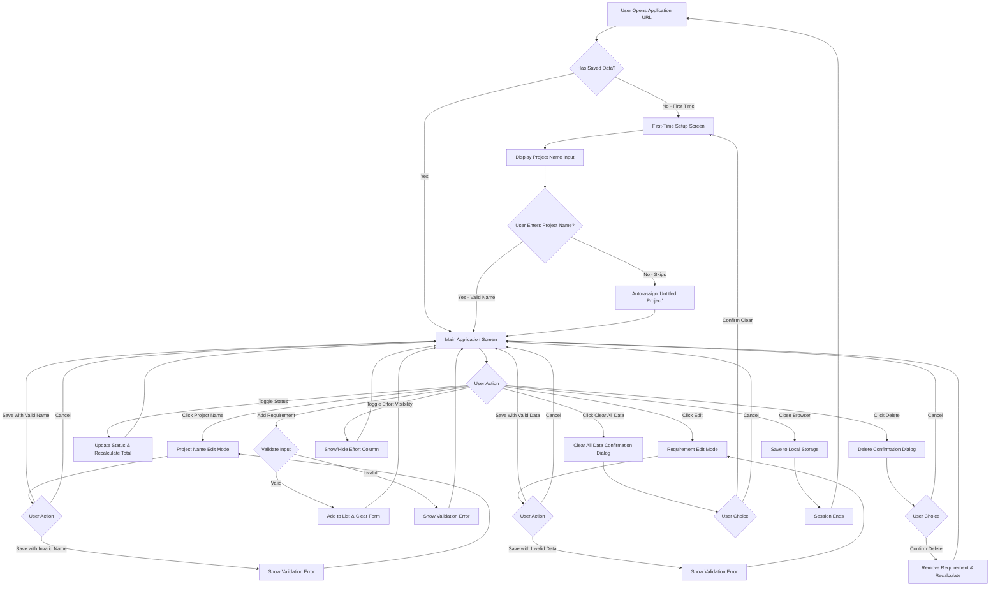

# UX/UI Requirements Document
## Requirement & Effort Tracker MVP

**Document Version:** 1.0
**Date:** 2025-12-19
**Purpose:** This document defines the user experience and interface requirements for the Requirement & Effort Tracker MVP. It provides comprehensive specifications for all screens, user interactions, and data flows to enable the UI/UX design team to create screen prototypes and mockups.

---

## Table of Contents
1. [Complete User Flow Diagram](#1-complete-user-flow-diagram)
2. [Screen-by-Screen Breakdown](#2-screen-by-screen-breakdown)
3. [Global UI Behaviors](#3-global-ui-behaviors)
4. [Interaction Patterns Summary](#4-interaction-patterns-summary)

---

## 1. Complete User Flow Diagram

### User Flow Description

**Primary Flow (New User):**
1. User navigates to application URL (no authentication required)
2. Application checks for existing data in local storage
3. If no data exists, display project name input
4. User enters project name or skips (defaults to "Untitled Project")
5. Main application screen loads with empty requirements list
6. User adds requirements using the form
7. Each addition updates the display and saves to local storage
8. User can manage requirements (edit, delete, toggle status)
9. All changes persist automatically

**Secondary Flow (Returning User):**
1. User navigates to application URL
2. Application detects existing data in local storage
3. Main application screen loads with saved data
4. User continues managing their project
5. All changes persist automatically

**Alternative Paths:**
- Edit project name at any time from main screen
- Toggle effort column visibility to hide/show effort values
- Clear all data to start fresh project
- Toggle individual requirement status to include/exclude from total

---

## 2. Screen-by-Screen Breakdown

### Screen 1: First-Time Setup Screen

**Screen Name:** First-Time Project Setup

**Screen Purpose:**
Displayed only when no saved data exists in local storage. Captures initial project name and transitions user to the main application interface.

**User Interactions:**
- Enter text into project name input field
- Click/tap "Continue" or "Start" button to proceed
- Click/tap "Skip" link/button to use default name
- Press Enter key in input field to proceed (keyboard shortcut)

**Input Fields:**

| Field Name | Type | Required | Validation Rules | Default Value | Placeholder Text |
|------------|------|----------|------------------|---------------|------------------|
| Project Name | Text | No (can skip) | - Max 100 characters - Cannot be only whitespace - If empty or whitespace only, defaults to "Untitled Project" - Special characters allowed | "Untitled Project" (if skipped) | "Enter your project name" |

**Output/Displayed Data:**
- Welcome message or heading (e.g., "Welcome to Requirement & Effort Tracker")
- Instructions (e.g., "Give your project a name to get started")
- Project name input field
- "Continue"/"Start" button
- "Skip" link or button (optional, smaller/less prominent)

**Navigation:**
- **From:** Application entry point (URL)
- **To:** Main Application Screen (after name entry or skip)
- **Trigger:** User clicks Continue/Start button OR presses Enter in input field OR clicks Skip

**Error States:**
- **Project name exceeds 100 characters:**
  - Error message: "Project name must not exceed 100 characters"
  - Display: Below or adjacent to input field
  - Behavior: Prevent proceeding until corrected

**Success States:**
- **Valid project name entered:**
  - Success indicator: None needed (immediate transition)
  - Action: Transition to Main Application Screen
- **User skips naming:**
  - Success indicator: None needed (immediate transition)
  - Action: Set project name to "Untitled Project" and transition to Main Application Screen

---

### Screen 2: Main Application Screen

**Screen Name:** Main Application Screen (Dashboard)

**Screen Purpose:**
Primary interface where users manage their project. Displays project name, requirement list, add requirement form, total effort calculation, and all management controls.

**User Interactions:**

**Project Name Area:**
- Click/tap project name to edit it
- Hover over project name to indicate it's editable (cursor change)

**Add Requirement Form:**
- Enter text into requirement description field
- Enter numeric value into effort field
- Click/tap "Add Requirement" button
- Press Enter in either field to submit (keyboard shortcut)
- Tab between fields for keyboard navigation

**Requirements List:**
- Click/tap status toggle (checkbox/switch) to change Active/Inactive status
- Click/tap "Edit" button to enter edit mode for a requirement
- Click/tap "Delete" button to trigger delete confirmation
- Scroll through list if many requirements exist

**Display Controls:**
- Click/tap "Hide Effort" / "Show Effort" button to toggle column visibility
- Click/tap "Clear All Data" / "New Project" link/button to trigger clear confirmation

**Input Fields:**

**Add Requirement Form:**

| Field Name | Type | Required | Validation Rules | Default Value | Placeholder Text |
|------------|------|----------|------------------|---------------|------------------|
| Requirement Description | Text (multiline or single line) | Yes | - Cannot be empty or only whitespace - Max 500 characters - Special characters allowed | Empty | "Enter requirement description" |
| Effort | Number | Yes | - Must be numeric - Must be greater than 0 - Max value: 1000 - Decimals allowed (e.g., 0.5, 1.5, 13.75) | Empty | "0.0" or "Enter effort" |

**Dependencies:**
- Both fields must be valid for "Add Requirement" button to submit successfully
- After successful addition, both fields clear and focus returns to description field

**Output/Displayed Data:**

**Project Name Section:**
- Project name displayed as prominent heading at top of screen
- Visual indicator that name is clickable/editable (subtle styling)

**Total Effort Display:**
- Label: "Total Active Effort" or "Total Effort"
- Value: Numeric sum of all active requirements, formatted to 2 decimal places
- Dynamic: Updates in real-time when requirements are added, edited, deleted, or status changes
- Shows "0" or "0.00" when no active requirements exist

**Requirements List (Table/List Format):**
Each row displays:
- **Status Toggle Column:** Checkbox or switch control (checked = Active, unchecked = Inactive)
- **Requirement Description Column:** Full text of requirement
- **Effort Column:** Numeric effort value (can be hidden via toggle control)
- **Actions Column:** "Edit" and "Delete" buttons/icons

Visual distinction for inactive requirements:
- Reduced opacity OR grayed out appearance
- Maintains readability of text

**Empty State:**
When no requirements exist:
- Message: "No requirements yet. Add your first requirement above."
- Display: In place of requirements list

**List Ordering:**
- Requirements displayed in chronological order (oldest first, newest last)
- Order preserved after edits and status changes

**Effort Column Visibility Control:**
- Button/toggle labeled "Hide Effort" when visible
- Button/toggle labeled "Show Effort" when hidden
- When hidden: Effort column (header and all values) removed from display
- When hidden: Description column expands to use available space
- Optional: Total effort summary may also hide based on preference

**Navigation:**
- **From:** First-Time Setup Screen OR returning user entry point
- **To:**
  - Project Name Edit Mode (when project name clicked)
  - Requirement Edit Mode (when Edit button clicked)
  - Delete Confirmation Dialog (when Delete button clicked)
  - Clear All Data Confirmation Dialog (when Clear All Data clicked)
- **Refresh/Reload:** Stays on Main Application Screen with persisted data
- **Close/Reopen Browser:** Returns to Main Application Screen with persisted data

**Error States:**

**Add Requirement - Description Validation:**
- **Empty description:**
  - Error message: "Requirement description is required"
  - Display: Below or adjacent to description field
  - Timing: On submit attempt
- **Description exceeds 500 characters:**
  - Error message: "Description must not exceed 500 characters"
  - Display: Below or adjacent to description field
  - Timing: On submit attempt or real-time (design team choice)

**Add Requirement - Effort Validation:**
- **Empty effort:**
  - Error message: "Effort value is required"
  - Display: Below or adjacent to effort field
  - Timing: On submit attempt
- **Non-numeric effort:**
  - Error message: "Effort must be a number"
  - Display: Below or adjacent to effort field
  - Timing: On submit attempt
- **Zero or negative effort:**
  - Error message: "Effort must be greater than 0"
  - Display: Below or adjacent to effort field
  - Timing: On submit attempt
- **Effort exceeds 1000:**
  - Error message: "Effort must not exceed 1000"
  - Display: Below or adjacent to effort field
  - Timing: On submit attempt

**Multiple Validation Errors:**
- Both description and effort errors can display simultaneously
- Each error message appears near its respective field

**Error Message Behavior:**
- Errors appear only when validation fails
- Errors disappear when user begins correcting input (on input change)

**Success States:**

**Add Requirement Success:**
- Success indicator: None needed (immediate visual feedback)
- Actions:
  - New requirement appears at bottom of list
  - Both input fields clear
  - Focus returns to description field
  - Total effort updates if applicable
  - Data saved to local storage

**Toggle Status Success:**
- Success indicator: Visual change in row appearance (grayed/normal)
- Actions:
  - Status toggle state changes (checked/unchecked)
  - Row visual styling updates
  - Total effort recalculates and updates
  - Data saved to local storage

**Toggle Effort Visibility Success:**
- Success indicator: Column appearance/disappearance
- Actions:
  - Effort column and header hide or show
  - Button label changes ("Hide Effort" ↔ "Show Effort")
  - Description column resizes
  - Preference saved to local storage

---

### Screen 3: Project Name Edit Mode

**Screen Name:** Project Name Edit Mode

**Screen Purpose:**
Allows user to modify the project name inline without navigating away from main screen.

**User Interactions:**
- Type new project name in text field
- Click/tap "Save" button to confirm changes
- Click/tap "Cancel" button to discard changes
- Press Enter to save (keyboard shortcut)
- Press Escape to cancel (keyboard shortcut)
- Click outside edit area to cancel (optional behavior)

**Input Fields:**

| Field Name | Type | Required | Validation Rules | Default Value | Placeholder Text |
|------------|------|----------|------------------|---------------|------------------|
| Project Name | Text | Yes (cannot be empty) | - Max 100 characters - Cannot be only whitespace - Special characters allowed | Current project name (pre-filled) | N/A |

**Output/Displayed Data:**
- Text input field pre-filled with current project name
- "Save" button
- "Cancel" button
- Focus automatically set to input field with text selected (for easy overwriting)

**Navigation:**
- **From:** Main Application Screen (click on project name)
- **To:** Main Application Screen (after save or cancel)
- **Trigger:** Clicking project name activates edit mode
- **Exit:** Save button, Cancel button, Enter key, Escape key, or click outside

**Error States:**
- **Empty project name or only whitespace:**
  - Error message: "Project name cannot be empty"
  - Display: Below or adjacent to input field
  - Behavior: Prevent saving until corrected
- **Project name exceeds 100 characters:**
  - Error message: "Project name must not exceed 100 characters"
  - Display: Below or adjacent to input field
  - Behavior: Prevent saving until corrected

**Success States:**
- **Valid project name saved:**
  - Success indicator: None needed (immediate transition)
  - Actions:
    - Project name updates in display
    - Edit mode closes, returns to normal display
    - Data saved to local storage
- **Edit canceled:**
  - Success indicator: None needed (immediate transition)
  - Actions:
    - Original project name preserved
    - Edit mode closes, returns to normal display
    - No data changes

---

### Screen 4: Requirement Edit Mode

**Screen Name:** Requirement Edit Mode (Inline Row Editing)

**Screen Purpose:**
Allows user to modify an existing requirement's description and effort value inline within the requirements list.

**User Interactions:**
- Type new description in text field
- Type new effort value in number field
- Click/tap "Save" button to confirm changes
- Click/tap "Cancel" button to discard changes
- Press Enter to save (keyboard shortcut)
- Press Escape to cancel (keyboard shortcut)
- Tab between fields for keyboard navigation

**Implementation Note:**
- Only one requirement can be in edit mode at a time
- Clicking "Edit" on another requirement automatically cancels any in-progress edit

**Input Fields:**

| Field Name | Type | Required | Validation Rules | Default Value | Placeholder Text |
|------------|------|----------|------------------|---------------|------------------|
| Requirement Description | Text (multiline or single line) | Yes | - Cannot be empty or only whitespace - Max 500 characters - Special characters allowed | Current description (pre-filled) | N/A |
| Effort | Number | Yes | - Must be numeric - Must be greater than 0 - Max value: 1000 - Decimals allowed | Current effort (pre-filled) | N/A |

**Output/Displayed Data:**
- Text input field with current requirement description
- Number input field with current effort value
- "Save" button
- "Cancel" button
- Status toggle remains visible but may be disabled during edit
- Delete button may be hidden or disabled during edit

**Navigation:**
- **From:** Main Application Screen (click "Edit" button on a requirement row)
- **To:** Main Application Screen (after save or cancel)
- **Trigger:** Clicking "Edit" button transforms row into edit mode
- **Exit:** Save button, Cancel button, Enter key, Escape key

**Error States:**

**Description Validation:**
- **Empty description:**
  - Error message: "Requirement description is required"
  - Display: Below or within the edit row
  - Timing: On save attempt
- **Description exceeds 500 characters:**
  - Error message: "Description must not exceed 500 characters"
  - Display: Below or within the edit row
  - Timing: On save attempt

**Effort Validation:**
- **Empty effort:**
  - Error message: "Effort value is required"
  - Display: Below or within the edit row
  - Timing: On save attempt
- **Non-numeric effort:**
  - Error message: "Effort must be a number"
  - Display: Below or within the edit row
  - Timing: On save attempt
- **Zero or negative effort:**
  - Error message: "Effort must be greater than 0"
  - Display: Below or within the edit row
  - Timing: On save attempt
- **Effort exceeds 1000:**
  - Error message: "Effort must not exceed 1000"
  - Display: Below or within the edit row
  - Timing: On save attempt

**Multiple Errors:**
- Both description and effort errors can display simultaneously within edit row

**Success States:**
- **Valid changes saved:**
  - Success indicator: None needed (immediate visual feedback)
  - Actions:
    - Row returns to display mode with updated values
    - Total effort recalculates if requirement is active
    - Requirement's "Last Modified Date" updates
    - Data saved to local storage
    - Requirement's status (Active/Inactive) preserved
- **Edit canceled:**
  - Success indicator: None needed (immediate visual feedback)
  - Actions:
    - Row returns to display mode with original values
    - No data changes

---

### Screen 5: Delete Requirement Confirmation Dialog

**Screen Name:** Delete Requirement Confirmation

**Screen Purpose:**
Confirms user intent before permanently deleting a requirement. Prevents accidental data loss.

**User Interactions:**
- Click/tap "Delete" button to confirm deletion
- Click/tap "Cancel" button to dismiss dialog
- Press Enter to confirm (keyboard shortcut)
- Press Escape to cancel (keyboard shortcut)
- Click outside dialog to cancel (optional behavior)

**Input Fields:**
- None (this is a confirmation dialog only)

**Output/Displayed Data:**
- **Dialog Title/Heading:** "Delete Requirement" or "Confirm Deletion"
- **Message:** "Are you sure you want to delete this requirement?"
- **Optional:** Display the requirement description being deleted for context
- **Buttons:**
  - Primary button: "Delete" (destructive action, may use warning color)
  - Secondary button: "Cancel" (safe action)

**Navigation:**
- **From:** Main Application Screen (click "Delete" button on a requirement row)
- **To:** Main Application Screen (after confirmation or cancellation)
- **Trigger:** Clicking "Delete" button on any requirement
- **Modal/Overlay:** Dialog appears as overlay above main screen

**Error States:**
- None (no user input to validate)

**Success States:**
- **Deletion confirmed:**
  - Success indicator: None needed (immediate visual feedback)
  - Actions:
    - Requirement removed from list
    - Total effort recalculates (if requirement was active)
    - Data saved to local storage
    - Dialog closes
    - Return to Main Application Screen
- **Deletion canceled:**
  - Success indicator: None needed (immediate visual feedback)
  - Actions:
    - Requirement preserved unchanged
    - Dialog closes
    - Return to Main Application Screen

---

### Screen 6: Clear All Data Confirmation Dialog

**Screen Name:** Clear All Data Confirmation

**Screen Purpose:**
Confirms user intent before clearing all project data. Prevents accidental loss of entire project. Allows user to start fresh with new project.

**User Interactions:**
- Click/tap "Clear All" or "Delete Everything" button to confirm
- Click/tap "Cancel" button to dismiss dialog
- Press Enter to confirm (keyboard shortcut)
- Press Escape to cancel (keyboard shortcut)
- Click outside dialog to cancel (optional behavior)

**Input Fields:**
- None (this is a confirmation dialog only)

**Output/Displayed Data:**
- **Dialog Title/Heading:** "Clear All Data" or "Start New Project"
- **Message:** "Are you sure you want to clear all data? This action cannot be undone."
- **Warning indicator:** Visual emphasis (icon, color) indicating destructive action
- **Buttons:**
  - Primary button: "Clear All" or "Delete Everything" (destructive action, warning color)
  - Secondary button: "Cancel" (safe action, more prominent)

**Navigation:**
- **From:** Main Application Screen (click "Clear All Data" or "New Project" control)
- **To:**
  - First-Time Setup Screen (if clear confirmed)
  - Main Application Screen (if canceled)
- **Trigger:** Clicking "Clear All Data" or "New Project" control on main screen
- **Modal/Overlay:** Dialog appears as overlay above main screen

**Error States:**
- None (no user input to validate)

**Success States:**
- **Clear confirmed:**
  - Success indicator: None needed (immediate transition)
  - Actions:
    - All requirements deleted
    - Project name reset
    - All data cleared from local storage
    - Application returns to First-Time Setup Screen
    - User prompted to enter new project name
- **Clear canceled:**
  - Success indicator: None needed (immediate visual feedback)
  - Actions:
    - All data preserved unchanged
    - Dialog closes
    - Return to Main Application Screen

---

## 3. Global UI Behaviors

### 3.1 Data Persistence
- **Timing:** All data changes save immediately to browser local storage
- **Trigger Events:**
  - Adding a requirement
  - Editing a requirement
  - Deleting a requirement
  - Toggling requirement status
  - Editing project name
  - Toggling effort column visibility
  - Changing any user preferences
- **User Feedback:** No explicit "saving" indicator needed (saves are instantaneous and invisible)

### 3.2 Loading Behavior
- **On Application Open:**
  - Check local storage for existing data
  - If data exists: Load and display on Main Application Screen
  - If no data: Display First-Time Setup Screen
- **Loading Indicator:** Optional, only if data loading is noticeably delayed

### 3.3 Responsive Behavior
- Application should work on desktop and mobile browsers
- Touch-friendly controls (adequate tap target sizes)
- Keyboard navigation support for desktop users
- Mobile considerations:
  - Numeric keyboard for effort input on mobile devices
  - Touch-optimized status toggles (switches vs. checkboxes)
  - Appropriate text input keyboards (default for descriptions)

### 3.4 Browser Compatibility
- Must work in modern browsers (Chrome, Firefox, Safari, Edge)
- Local storage support required
- Graceful degradation if local storage unavailable (show warning message)

### 3.5 Accessibility Considerations
- All interactive elements must be keyboard accessible
- Form fields must have proper labels (visible or accessible labels)
- Error messages must be associated with their input fields
- Focus management during modal dialogs
- Sufficient color contrast for text readability
- Status toggles must be clearly labeled for screen readers

---

## 4. Interaction Patterns Summary

### 4.1 Form Submission Patterns
- **Add Requirement Form:** Submit via button click or Enter key press
- **Edit Mode (Project Name & Requirements):** Save via button click or Enter key press
- **Cancellation:** Cancel button or Escape key press
- **Validation:** On submit attempt (not necessarily on blur or real-time, but design team may choose real-time feedback)
- **Error Display:** Inline, near relevant fields
- **Error Clearing:** On input change (errors disappear when user starts correcting)

### 4.2 Confirmation Dialog Patterns
- **Trigger:** Destructive actions (Delete, Clear All)
- **Display:** Modal/overlay above main content
- **Buttons:** Clear primary and secondary actions
- **Dismissal:** Cancel button, Escape key, or click outside (design team choice)
- **Visual Weight:** Destructive actions should be visually distinct but not the most prominent (secondary vs. primary button styling)

### 4.3 Inline Editing Patterns
- **Activation:** Click on editable element (project name) or click Edit button (requirements)
- **Mode Change:** Element transforms into edit controls in place
- **Focus Management:** Auto-focus on primary input field
- **Single Edit:** Only one requirement in edit mode at a time
- **Cancellation Behavior:** Discard changes, restore original values

### 4.4 Toggle Patterns
- **Requirement Status Toggle:** Immediate effect, no confirmation
- **Effort Column Visibility Toggle:** Immediate effect, no confirmation
- **Visual Feedback:** Toggle control state changes immediately
- **Data Impact:** Status toggles affect calculations, visibility toggles affect display only

### 4.5 List Display Patterns
- **Empty State:** Friendly message guiding users to add first item
- **Ordering:** Chronological (oldest first, newest last)
- **Visual States:** Clear distinction between active and inactive items
- **Row Actions:** Edit and Delete buttons visible on each row
- **Status Indicator:** Toggle control visible on each row

### 4.6 Calculation Display Patterns
- **Real-Time Updates:** Total effort updates immediately on any relevant change
- **Decimal Precision:** Display up to 2 decimal places (e.g., 13.75)
- **Zero State:** Display "0" or "0.00" when no active requirements
- **Visibility:** Total effort may remain visible even when effort column hidden (configurable)

---

## 5. Data Validation Reference

### 5.1 Project Name Validation
| Rule | Validation Message | Timing |
|------|-------------------|--------|
| Required (cannot be only whitespace) | "Project name cannot be empty" | On save attempt |
| Max 100 characters | "Project name must not exceed 100 characters" | On save attempt |

### 5.2 Requirement Description Validation
| Rule | Validation Message | Timing |
|------|-------------------|--------|
| Required (cannot be empty or only whitespace) | "Requirement description is required" | On submit attempt |
| Max 500 characters | "Description must not exceed 500 characters" | On submit attempt |

### 5.3 Effort Value Validation
| Rule | Validation Message | Timing |
|------|-------------------|--------|
| Required | "Effort value is required" | On submit attempt |
| Must be numeric | "Effort must be a number" | On submit attempt |
| Must be greater than 0 | "Effort must be greater than 0" | On submit attempt |
| Max 1000 | "Effort must not exceed 1000" | On submit attempt |

---

## 6. Screen Transitions Summary

| From Screen | To Screen | Trigger | Transition Type |
|------------|-----------|---------|-----------------|
| Application Entry | First-Time Setup | No saved data exists | Load |
| Application Entry | Main Application | Saved data exists | Load |
| First-Time Setup | Main Application | User enters/skips project name | Navigate |
| Main Application | Project Name Edit Mode | Click project name | Inline transformation |
| Project Name Edit Mode | Main Application | Save or Cancel | Inline transformation |
| Main Application | Requirement Edit Mode | Click Edit button | Inline row transformation |
| Requirement Edit Mode | Main Application | Save or Cancel | Inline row transformation |
| Main Application | Delete Confirmation Dialog | Click Delete button | Modal overlay |
| Delete Confirmation Dialog | Main Application | Confirm or Cancel | Dismiss modal |
| Main Application | Clear All Confirmation Dialog | Click Clear All Data | Modal overlay |
| Clear All Confirmation Dialog | Main Application | Cancel | Dismiss modal |
| Clear All Confirmation Dialog | First-Time Setup | Confirm | Navigate |

---

## 7. Component Inventory

### 7.1 Core UI Components Needed
- **Text Input Fields** (single-line and optionally multi-line)
- **Number Input Fields** (with decimal support)
- **Buttons** (primary, secondary, destructive)
- **Toggle Controls** (checkbox or switch for status)
- **Modal Dialogs** (for confirmations)
- **Table/List Display** (for requirements)
- **Headings** (for project name display)
- **Inline Edit Controls** (input fields with save/cancel buttons)
- **Error Message Display** (inline with forms)
- **Empty State Messages** (for empty list)

### 7.2 Layout Sections
- **Header Section:** Project name display/edit
- **Add Form Section:** Input fields and add button
- **Control Section:** Effort visibility toggle, clear all data button
- **List Section:** Requirements table/list with columns
- **Summary Section:** Total effort display
- **Modal Overlays:** Confirmation dialogs

---

## 8. User Assistance and Feedback

### 8.1 Empty States
- **No Requirements:** "No requirements yet. Add your first requirement above."
- **All Requirements Inactive:** List shows requirements but total effort displays 0

### 8.2 Validation Feedback
- **Timing:** On submit/save attempt
- **Placement:** Inline, near relevant input field
- **Appearance:** Distinct styling (color, icon) to indicate error
- **Clearing:** Automatically disappear when user corrects input

### 8.3 Destructive Action Warnings
- **Delete Requirement:** Confirmation dialog with clear warning
- **Clear All Data:** Confirmation dialog with emphasis on irreversibility

### 8.4 Visual Feedback
- **Status Changes:** Immediate visual update (row appearance, toggle state)
- **Column Visibility:** Immediate show/hide with layout reflow
- **List Updates:** Immediate display of added/edited/deleted items
- **Calculation Updates:** Immediate update of total effort value

---

## 9. Edge Cases and Special Scenarios

### 9.1 Data Edge Cases
| Scenario | Expected Behavior |
|----------|------------------|
| No active requirements | Total effort displays as 0 |
| All requirements inactive | Total effort displays as 0, list shows all requirements grayed out |
| All requirements deleted | Empty state message appears, total effort displays as 0 |
| Decimal effort values (e.g., 0.5, 13.75) | Accepted, calculated correctly, displayed with up to 2 decimal places |
| Very long requirement description (near 500 chars) | Accepted if within limit, displayed fully (may wrap or truncate with ellipsis) |
| Effort column hidden | Column and header removed, description column expands, total may remain visible |
| Browser storage cleared externally | Application resets to First-Time Setup Screen on next load |
| Browser storage full | Current data remains, new saves may fail (out of scope for MVP) |

### 9.2 Interaction Edge Cases
| Scenario | Expected Behavior |
|----------|------------------|
| Editing one requirement while another is in edit mode | First edit is automatically canceled, second edit mode activates |
| Pressing Escape during edit | Edit canceled, original values preserved |
| Pressing Enter in project name edit | Save attempted with validation |
| Clicking outside modal dialog | Dialog closes/cancels (optional design choice) |
| Rapid-fire adding requirements | Each submission processed sequentially, all saved |
| Editing requirement while add form has unsaved data | Both can coexist, no conflict (add form and edit row are separate) |

### 9.3 Browser Behavior Edge Cases
| Scenario | Expected Behavior |
|----------|------------------|
| Page refresh during edit | Edit canceled, original data preserved from local storage |
| Browser back button | No navigation history within app (single-page), browser navigates away from app |
| Multiple tabs open | Each tab operates independently, last save wins (no conflict resolution in MVP) |
| Browser local storage disabled | Application shows error message, cannot function without storage |

---

## 10. Design Team Considerations

### 10.1 What This Document Defines
- All screens and their purpose
- User interactions and navigation flows
- Input fields, validation rules, and data requirements
- Error states and success states
- Functional behavior and data display logic
- Interaction patterns and user feedback

### 10.2 What Design Team Will Define
- Visual layout and positioning of elements
- Spacing, margins, padding, grid systems
- Color schemes, typography, font sizes
- Visual styling of components (buttons, inputs, toggles)
- Iconography and visual indicators
- Animation and transitions (optional)
- Responsive breakpoints and layouts
- Accessibility implementation details (ARIA attributes, focus indicators)
- Component library selection or custom component design

### 10.3 Design Decisions to Consider
1. **Project Name Edit:** Inline edit vs. modal dialog?
2. **Status Toggle:** Checkbox vs. switch control?
3. **Requirement Description:** Single-line vs. multi-line text input?
4. **Mobile Layout:** Stacked form vs. side-by-side layout?
5. **Effort Column Toggle:** Button vs. checkbox vs. menu item?
6. **Delete Confirmation:** Modal dialog vs. inline confirmation?
7. **Error Messages:** Inline vs. toast notifications?
8. **Empty State:** Text only vs. illustration + text?
9. **Total Effort Display:** Card vs. inline section vs. sticky header?
10. **Clear All Data Control:** Prominent vs. hidden in menu/settings?

---

## Document Revision History

| Version | Date | Author | Changes |
|---------|------|--------|---------|
| 1.0 | 2025-12-19 | AI Assistant | Initial UX/UI requirements document created from functional requirements |

---

## Appendix: Glossary

- **Active Status:** A requirement included in the total effort calculation
- **Inactive Status:** A requirement excluded from the total effort calculation
- **Inline Edit:** Editing an element directly in place without navigating to a separate screen
- **Modal Dialog:** An overlay window that appears above the main interface, requiring user interaction
- **Local Storage:** Browser-based data persistence mechanism
- **Validation:** Process of checking user input against defined rules
- **Empty State:** UI display when no data exists in a list or collection
- **Toggle Control:** UI element for switching between two states (on/off, active/inactive)
- **Destructive Action:** An action that permanently deletes or removes data
- **Real-Time Update:** UI changes that occur immediately in response to user actions without page refresh

---

**End of Document**
